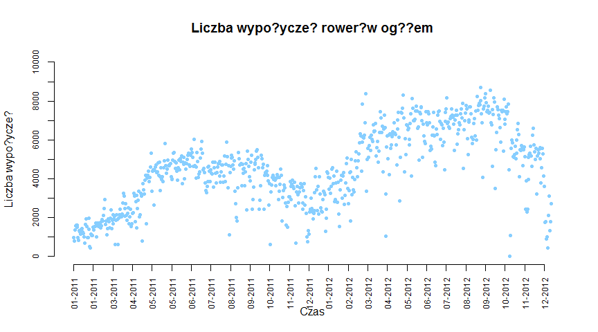
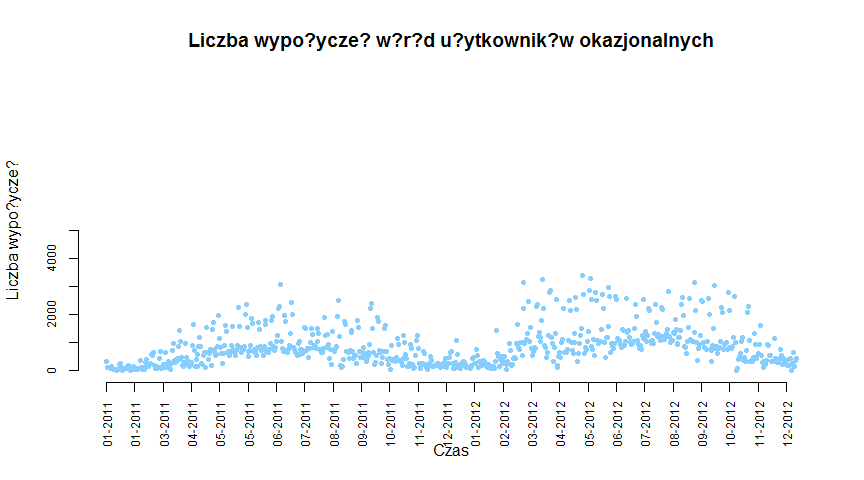
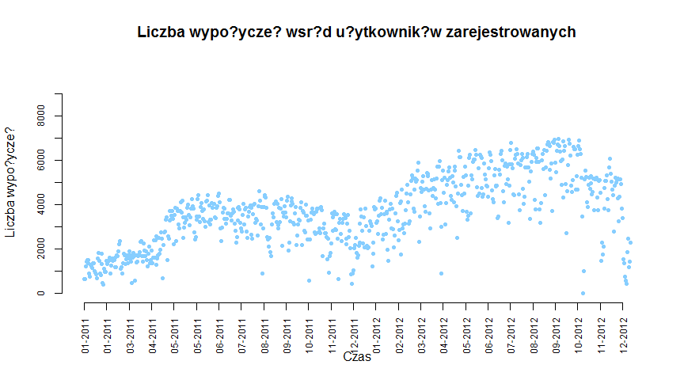
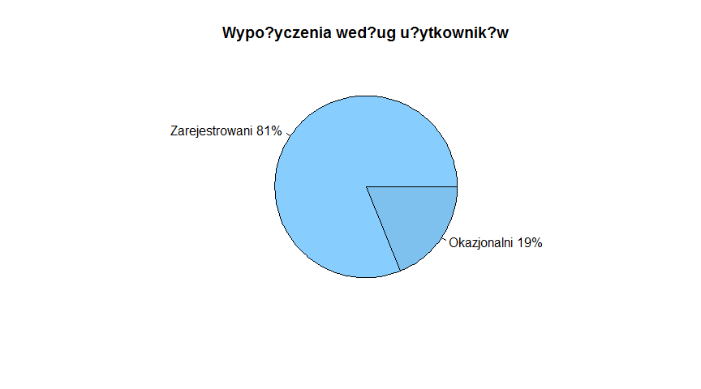
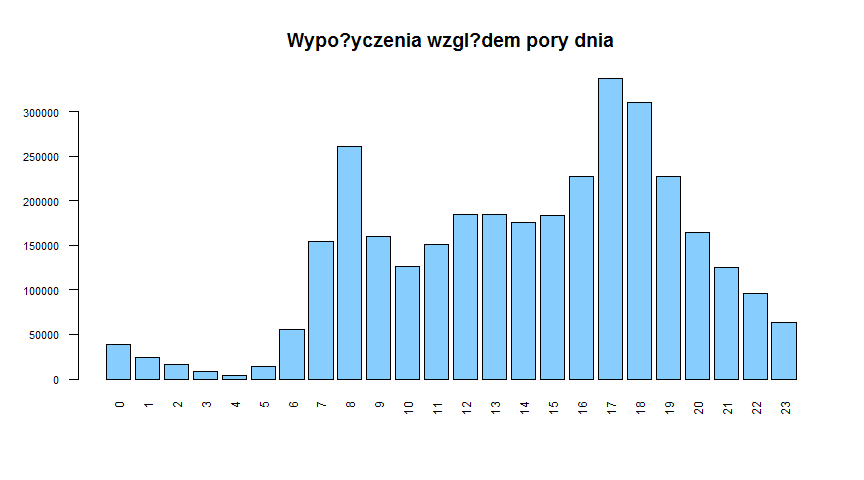
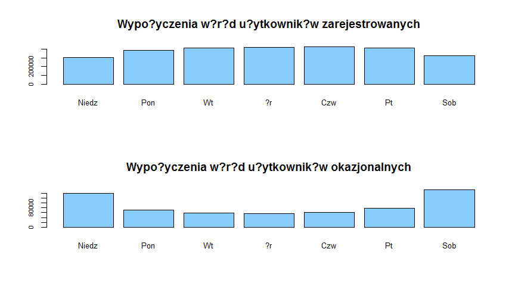
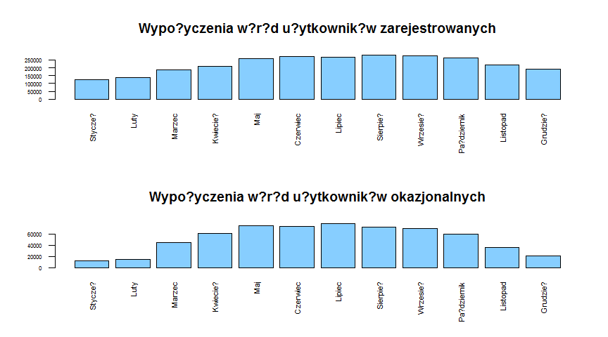
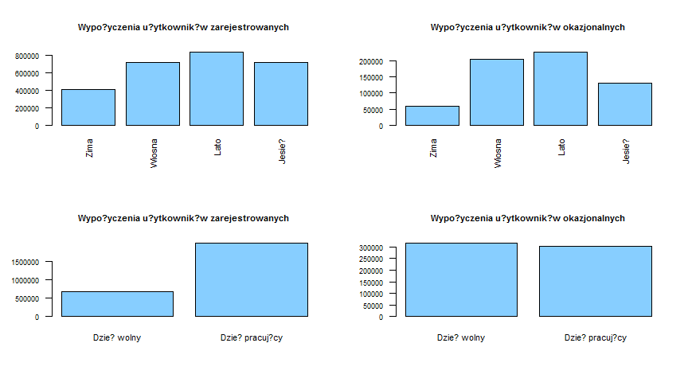
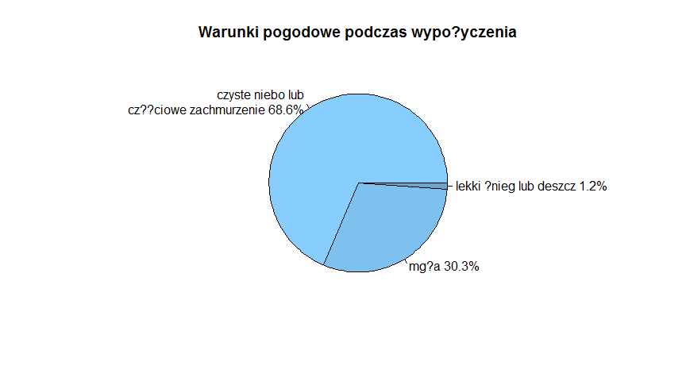
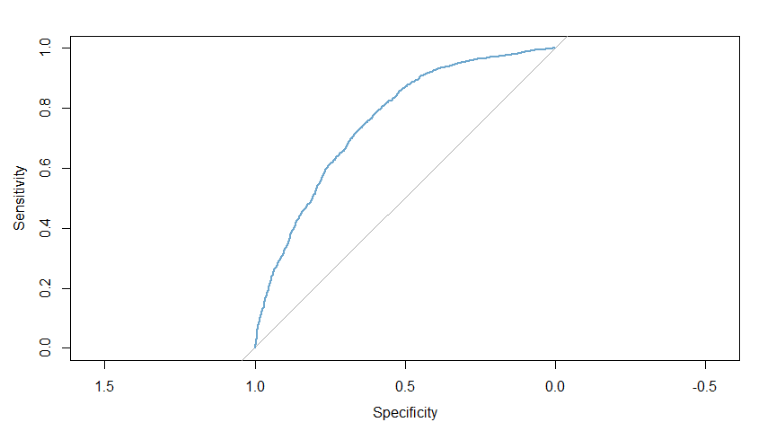

### **1. ?r?d?o danych**

#### **1.1. Informacje o ?r?dle** 

Dane do analizy zosta?y pobrane z og?lnodost?pnego repozytorium zbior?w
danych UC Irvine Machine Learning Repository (UCI). Bezpo?redni
[link](http://archive.ics.uci.edu/ml/datasets/Bike+Sharing+Dataset) do
zbioru danych.

#### **1.2. Pliki ze zbiorami danych**

W powy?szym linku do repozytorium UCI znajduj? si? dwa pliki o
rozszerzeniu *.csv* ze zbiorami danych. Przperowadzono analiz? z
wykorzystaniem obydwu zbior?w danych:

1.  plik **day.csv** zawieraj?cy dane dotycz?ce wypo?ycze? rower?w
    zagregowane wed?ug dni. Liczba obserwacji obejmuje 731 dni.
2.  plik **hour.csv** zawieraj?cy dane dotycz?ce wypo?ycze? rower?w w
    poszczeg?lnych dniach zagregowane wed?ug godzin. Liczba obserwacji
    obejmuje 17 379 godzin.

#### **1.3. Zawarto?? zbior?w danych**

Zar?wno zbi?r **hour.csv**, jak i **day.csv** zawieraj? taki sam zestaw
zmiennych. Jednyn? r??nic? jest dodatkowa zmienna *hr*, kt?ra okre?la
godzin? wypo?yczenia roweru w zbiorze *hour*.

Zakres danych obejmuje dzienne obserwacje pocz?wszy od 1 stycznia 2011
roku do 31 grudnia 2012 roku. Dane pochodz? z systemu wypo?yczalni
*Capital Bikeshare* w Waszyngtonie w USA.

Charakterystyka zbior?w danych:

-   ***instant*** - numer obserwacji
-   ***dteday*** - data wypo?yczenia roweru
-   ***season*** - pora roku, gdzie:
    -   1 - wiosna
    -   2 - lato
    -   3 - jesie?
    -   4 - zima
-   ***yr*** - rok, zmienna dychotomiczna:
    -   0 - rok 2011
    -   1 - rok 2012
-   ***mnth*** - miesi?c od 1 do 12, gdzie:
    -   1 - stycze?
    -   2 - luty
    -   …
    -   11 - listopad
    -   12 - grudzie?
-   ***hr*** - godzina od godziny 0 do godziny 23
-   ***holiday*** - ?wi?to, zmienna dychotomiczna:
    -   1 - dany dzie? jest dniem ?wi?tecznym
    -   0 - dany dzie? nie jest dniem ?wi?tecznym *Kalendarz dni
        ?wi?tecznych dotyczy USA. Dane wed?ug [strony
        internetowej](http://dchr.dc.gov/page/holiday-schedule)*
-   ***weekday*** - dzie? tygodnia, gdzie:
    -   0 - niedziela
    -   1 - poniedzia?ek
    -   …
    -   5 - pi?tek
    -   6 - sobota
-   ***workingday*** - dzie? pracuj?cy, zmienna dychotomiczna:
    -   1 - dany dzie? jest dniem pracuj?cym
    -   0 - dany dzie? wypada w weekend lub jest to dzie? ?wi?teczny
-   ***weathersit*** - warunki atmosferyczne:
    -   1 - czyste niebo lub cz??ciowe zachmurzenie
    -   2 - mg?a
    -   3 - lekki ?nieg lub deszcz
    -   4 - ci??ki ?nieg lub deszcz, grad, burza
-   ***temp*** - Temperatura w stopniach Celsjusza poddana
    standaryzacji. Warto?? min -8, max +39  
-   ***atemp*** - Odczuwana temperatura w stopniach Celsjusza poddana
    standaryzacji. Warto?? min -16, max +50  
-   ***hum*** - Standaryzowana wilgotno?? powietrza. Warto?? max 100
-   ***windspeed*** - Standaryzowana pr?dko?? wiatru. Warto?? max 67
-   ***casual*** - liczba wypo?ycze? przez
    przypadkowych/niezarejestrowanych u?ytkownik?w
-   ***registered*** - liczba wypo?ycze? przez zarejestrowanych
    u?ytkownik?w
-   ***cnt*** - liczba wypo?ycze? przez u?ytkownik?w niezarejestrowanych
    oraz zarejestrowanych

### **2. Opis analizowanego zagadnienia**

Liczba wypo?ycze? rower?w publicznych jest ?ci?le skorelowana z
warunkami ?rodowiskowymi i sezonowymi. Czynnikami wp?ywaj?cymi na liczb?
wypo?ycze? mog? by? m.in.: opady atmosferyczne, temperatura powietrza,
pora roku, pora dnia, czy dzie? tygodnia.

System rower?w publicznych to nowa generacja tradycyjnych wypo?yczalni
rower?w. Przewag? nad tradycyjnymi wypo?yczalniami rower?w jest proces
rejestracji nowego u?ytkownika, wypo?yczenie oraz zwrot roweru, bowiem
wszystko to zosta?o w pe?ni zautomatyzowane. Dzi?ki temu, u?ytkownik
mo?e w bardzo prosty spos?b wypo?yczy? rower z okre?lonej lokalizacji i
odda? go z powrotem w innej.

Obecnie mo?na zaobserwowa? wzrost zainteresowania rowerami publicznymi,
kt?rych proces wypo?yczania staje si? coraz prostszy i wygodniejszy. Co
wi?cej, op?aty za wypo?yczenie nie s? zbyt wysokie. Dodatkowym atutem
jest aktywno?? fizyczna i kwestie zdrowotne oraz troska o jako??
powietrza w wielkich miastach, poniewa? rower nie emituje jakichkolwiek
spalin, kt?re zanieczyszczaj? ?rodowisko.

Opr?cz aspekt?w zdrowotnych oraz ?rodowiskowych, z rowerami publiczymi
zwi?zany jest r?wnie? aspekt ekonomiczny. Analiza liczby wypo?ycze? mo?e
da? odpowied? na pytania dotycz?ce strategii obranych przez firmy
zarz?dzaj?ce danymi wypo?yczalniami. Czy warto stworzy? nowy punkt w
okolicy najcz??ciej u?ywanej lokalizacji? Czy liczba rower?w jest
wystarczaj?ca? Jaka pora roku lub dnia jest najlepsza na wypo?yczenie
roweru? Czy ro?nie liczba zarejestrowanych u?ytkownik?w lub tych
okazjonalnych? To tylko przyk?adowe pytania, na kt?re odpowiedzi mog?
wskaza? kierunek rozwoju system?w wypo?yczalni rower?w publicznych w
miastach. Dodatkowo, charakterystyka danych generowanych przez te
systemy, czyni je atrakcyjnymi do analiz. W przeciwie?stwie do innych
us?ug transportowych, takich jak autobus lub metro, czas trwania i
miejsce podr??y s? rejestrowane w tych systemach. Ta funkcja zamienia
system wypo?yczania rower?w w wirtualn? sie? czujnik?w, kt?ra mo?e
s?u?y? np. do wykrywania mobilno?ci w mie?cie.

### **3. Cel analizy oraz pytania badawcze**

Celem analizy jest scharakteryzowanie systemu wypo?yczalni rower?w
publicznych w Waszyngtonie w latach 2011-2012.

Postawiono nast?puj?ce pytania badawcze:

-   Jaka jest tendencja w liczbie wypo?ycze? rower?w publicznych?
-   Jak kszta?tuje si? struktura liczby u?ytkownik?w systemu?
-   Jak rozk?ada si? liczba wypo?ycze? wzgl?dem pory dnia, dni tygodnia,
    miesi?cy i p?r roku?
-   Czy w dni wolne od pracy ludzie ch?tnie wypo?yczaj? rowery?
-   Czy warunki pogodowe maj? wp?yw na liczb? wypo?ycze??
-   Jakie czynniki maj? najwi?kszy wp?yw na fakt wypo?yczenia roweru lub
    nie?

### **4. Wst?pna analiza danych**

##### **Rysunek 1.** Tendencja w liczbie wypo?ycze? rower?w publicznych w?r?d u?ytkownik?w og??em

Liczba wypo?ycze? rower?w publicznych og??em w latach 2011-2012
charakteryzowa?a si? trendem rosn?cym. Widoczny jest on wzgl?dem
mi?si?cy maj-wrzesie? rok do roku. R?wnie? widoczny wzrost w liczbie
wypo?ycze? w pierwszych miesi?cach roku tj. stycze?-marzec, gdzie
zjawisko to wzros?o ?rednio o oko?o 1500. ?rednio najwi?cej wypo?ycze?
rower?w og??em zarejstrowano w miesi?cach letnich, gdy temperatura
sprzyja przemieszczaniu si? ?rodkiem transportu jakim jest rower. W roku
2011 ?rednio najwi?cej wypo?yczano rowery 5000 razy. Natomiast w roku
2012 najwi?cej wypo?yczano oko?o 7000 razy.

##### **Rysunek 2.** Tendencja w liczbie wypo?ycze? rower?w publicznych w?r?d u?ytkownik?w okazjonalnych

Liczba wypo?ycze? przez u?ytkownik?w, kt?rzy wypo?yczaj? rowery
okazyjnie ?rednio oscylowa?a na poziomie oko?o 1000 w roku 2011, a w
2012 oko?o 1500 razy. Wzrost liczby wypo?ycze? w tej kategorii
u?ykownik?w nie jest wyra?ny. Wyra?ny jest wzrost warto?ci obserwacji
odstaj?cych, kt?re wzros?y z poziomu oko?o 2000 w miesi?cach
maj-wrzesie? roku 2011 do poziomu oko?o 2000 wypo?ycze? w okresie
maj-wrzesie? 2012 roku. Co wi?cej, wysokie warto?ci odstaj?ce zosta?y
zaobserwowane w 2012 roku troch? wcze?niej, bowiem ju? w marcu.

##### **Rysunek 3.** Tendencja w liczbie wypo?ycze? rower?w publicznych w?r?d u?ytkownik?w zarejstrowanych

Powy?szy wykres wskazuje, ?e grupa u?ytkownik?w, kt?rzy s? zarejstrowani
w systemie rower?w publicznych ch?tniej wypo?ycza rowery, ni? grupa
u?ytkownik?w okazjonalnych, nieposiadaj?cych konta. U?ytkownicy
zarejstrowani wykazuj? zainteresowanie dalszym wypo?yczaniem rower?w,
poniewa? zauwa?alna jest wyra?na tendencja rosn?ca. ?rednio najwi?cej
razy u?ytkownicy zarejestrowani wypo?yczali rowery w 2011 roku w
miesi?cach maj-wrzesie?. W roku 2012 okres ten zosta? wyd?u?ony od marca
do pa?dziernika. Dodatkowo w pa?dzierniku zarejstrowano najwi?ksz?
liczb? wypo?ycze?. Podsumowuj?c, nastapi? wzrost ?redniego poziomu
wypo?ycze? rower?w oraz u?ytkownicy zarejestrowani zacz?li cz??ciej
wypo?ycza? rowery i wyd?u?yli ten okres w 2012 roku, ni? w roku
poprzednim.

##### **Rysunek 4.** Struktura u?ytkownik?w systemu wypo?ycze? rower?w publicznych

Powy?szy wykres wskazuje wyra?n? przewag? u?ytkownik?w korzystajacych z
systemu wypo?yczalni rower?w publicznych, kt?rzy s? w nim zarejsertowani
od tych, kt?rzy nie posiadaj? konta i wypozyczaj? rowery okazjonalnie.
U?ytkownicy zarejstrowani w latach 2011-2012 stanowili ??cznie 81%
wszystkich wypo?ycze?, natomiast u?ytkownicy okazjonalni tylko 19%.
??cznie w latach 2011-2012 wypo?yczano rowery 3292679 razy, w tym
u?ytkownicy zarejestrowani 2672662, a okazjonalni 620017 razy.

##### **Rysunek 5.** Rozk?ad wypo?ycze? og??em wzgl?dem pory dnia

Wykres pokazuje w jakich porach dnia w latach 2011-2012 nast?pi?a
najwi?ksza liczba wypo?ycze? rower?w w?r?d u?ytkownik?w og??em. Mo?na
zaobserwowa? dwie pory dnia, kt?re wyr??niaj? si? w ci?gu ca?ej doby. S?
to “szczyty komunikacyjne” - poranny w godzinach 7-9 oraz popo?udniowy w
godzinach 16-19. Przy czym najcz??ciej w tych porach dnia rowery by?y
wypo?yczane o godzinie 8 oraz 17 i 18. Mo?na przypuszcza?, ?e rowery
opr?cz aspekt?w rekreacyjnych stanowi? dogodny ?rodek komunikacji do
pracy, szko?y lub do domu. Warto r?wnie? zaznaczy?, ?e w szczycie
popo?udniowym ?rednio cz??ciej wypo?yczane by?y rowery ni? w szczycie
porannym. Najrzadziej wypo?ycza si? rowery w nocy/nad ranem w godzinach
3-4, bowiem wtedy ruch w systemie wypo?yczalni jest najmniejszy. W ci?gu
dnia pomi?dzy szczytami komunikacyjnymi, ruch w wypo?yczalni ro?nie do
okolic po?udnia, po tym delikatnie si? zmniejsza, ?eby znacznie wzrasta?
od godziny 16.

##### **Rysunek 6.** Rozk?ad wypo?ycze? rower?w wzgl?dem dnia tygodnia z podzia?em na rodzaj u?ytkownik?w

Wykresy pokazuj? wyra?n? r??nic? pomi?dzy u?ytkownikami, kt?rzy s?
zarejestrowani w systemie wypo?yczalni oraz tymi, kt?rzy korzystaj? z
rower?w okazjonalnie. U?ytkownicy zarejestrowani wypo?yczaj? rowery
najcz??ciej w pracuj?ce dni tygodnia, przy czym w weekend nieznacznie
mniej. Natomiast u?ytkownicy okazjonalni wypo?yczaj? rowery g??wnie w
weekendy, a liczba wypo?ycze? w dni pracuj?ce jest znacz?co ni?sza.

##### **Rysunek 7.** Rozk?ad wypo?ycze? rower?w wed?ug rodzaju u?ytkownik?w wzgl?dem miesi?ca

Kolejna grupa wykres?w pokauzje r??nice mi?dzy typami u?ytkownik?w w
systemie wypo?yczalni. U?ytkownicy zarejestrowani regularnie wypo?yczj?
rowery w ciagu roku. Najcz??ciej wypo?yczaj? oni w miesi?cach
maj-pa?dziernik. W pozosta?ych miesi?cach r??nica jest nieznaczna. Z
drugiej strony u?ytkownicy okazjonalni najch?tniej decyduj? si? na
wypo?yczenie roweru w miesi?cach marzec-pa?dziernik. Jednak?e w znacz?cy
spos?b rezygnuj? oni z wypo?yczania rower?w w pozosta?e miesi?ce. Mo?na
wyci?gn?? z tego wniosek, ?e u?ytkownicy zarejestrowani s? bardziej
lojalni wobec wypo?yczalni i staraj? si? korzysta? z tej us?ugi przez
ca?y rok. Natomiast u?ytkownicy okazjonalni, jak sama nazwa wskazuje,
korzystaj? z wypo?yczalni okazyjnie. Z pewno?ci? jest to uwarunkowane
przez warunki pogodowe i por? roku.

##### **Rysunek 8.** Rozk?ad wypo?ycze? rower?w wed?ug rodzaju u?ytkownik?w wzglem pory roku

Kolejne wykresy to uzupe?nienie oraz potwierdzenie analiz wykonanych
wcze?niej. Og??em ludzie cz??ciej decyduj? si? na wypo?yczenie rower?w
na wiosn? oraz w lecie. Wobec pozosta?ych p?r roku, u?ytkownicy
zarejestrowani wypo?yczaj? rowery cz??ciej ni? okazjonalni. R?wnie?
u?ytkownicy zarejestrowani wypo?yczaj? rowery cz??ciej w dni pracuj?ce.
Natomiast u?ytkownicy okazjonalni niewiele wi?cej decyduj? si? na
wypo?yczenie roweru w dzie? wolny od pracy.

##### **Rysunek 9.** Struktura wypo?ycze? rower?w wed?ug warunk?w pogodowych

Najcz??ciej rowery by?y wypo?yczane, gdy warunki atmosferyczne by?y
bardzo dobre tj. by?o czyste niebo lub niewielkie, cz??ciowe
zachmuerzenie. Takie warunki pogoodwe panowa?y podczas prawie 70%
wypo?ycze? og??em. W przypadku wyst?powania mg?y, wypo?yczenia stanowi?y
niewiele ponad 30%. Znikomy udzia? (1,2%) w liczbie wypo?ycze? stanowi?
wypo?yczenia podczas lekkich opad?w deszczu lub ?niegu. Natomiast 0% to
wypo?yczenia podczas ci??kich opad?w ?niegu lub deszczu, gradu i burzy
(w opisie zbioru danych wyst?puj? cztery kategorie warunk?w
atmosferycznych). Bior?c to wszystko pod uwag?, mo?na wnioskowa?, ?e
pogoda ma istotny wp?yw na decyzj? o wypo?yczeniu roweru.

Jednocze?nie mo?na sprawdzi? ile dni w ci?gu dw?ch lat obserwacji mia?y
poszczeg?lne kategorie warunk?w pogodowych. Najwi?cej by?o dni z
bezchmurnym niebem lub niewielkim zachmurzeniem. Z drugiej strony nie
wyst?pi?y ci??kie opady deszczu, ?niegu lub gradu i burzy.

    ##                                      summary.atmo.
    ## czyste niebo, cz??ciowe zachmurzenie           463
    ## mg?a                                           247
    ## lekki ?nieg lub deszcz                          21
    ## ci??ki ?nieg lub deszcz, grad, burza             0

A tak rozk?ada?a si? liczba wypo?ycze? z uwzgl?dnieniem poszczeg?lnych
warunk?w atmosferycznych.

    ##                                Group.1       x
    ## 1 czyste niebo, cz??ciowe zachmurzenie 2257952
    ## 2                                 mg?a  996858
    ## 3               lekki ?nieg lub deszcz   37869

### **5. Zaawansowana analiza zjawiska - regresja logistyczna**

Analiza za pomoc? narz?dzia regresji logistycznej mia?a na celu
sprawdzenie, kt?re z wybranych czynnik?w maj? najwi?kszy wp?yw na
wypo?yczenie rower?w. W tym celu zmienna *cnt* zosta?a zdychotomizowana
na warto?ci (0,1) na podstawie podzia?u wed?ug kwartyla 0.75. Obserwacje
r?wne lub poni?ej warto?ci kwartyla 0.75 zosta?y oznaczone jako 0,
natomiast powy?ej kwartyla 0.75 jako 1. Zbi?r zmiennych niezale?nych
stanowi? zmienne jako?ciowe oraz ilo?ciowe.

#### **5.1. Wyb?r zmiennych niezale?nych**

Wybrano nast?puj?cy zestaw zmiennych, kt?re zosta?y poddane analizie pod
wzgl?dem wprowadzenia do modelu:

-   ***season*** - pora roku
-   ***mnth*** - miesi?c
-   ***hr*** - godzina
-   ***holiday*** - ?wi?to
-   ***weekday*** - dzie? tygodnia
-   ***workingday*** - dzie? pracuj?cy
-   ***weathersit*** - warunki atmosferyczne
-   ***temp*** - Temperatura w stopniach Celsjusza poddana
    standaryzacji. Warto?? min -8, max +39  
-   ***atemp*** - standaryzowana odczuwana temperatura
-   ***hum*** - standaryzowana wilgotno?? powietrza
-   ***windspeed*** - standaryzowana pr?dko?? wiatru

#### **5.2. Model funkcji logistycznej**

Funckja *glm()* wyznaczy?a wsp??czynniki w modelu uog?lnionych modeli
liniowych (GLM - *Generalized Linear Models*). Parametr *binomial*
dotyczy rodziny rozk?ad?w dwumianowych, kt?ry spowoduje otrzymanie
modleu regresji logistycznej.

Wywo?anie funkcji regresji logistycznej oraz wygenerowanie podsumowa?
wynik?w r??nych funckji dopasowuj?cych model.

    ## 
    ## Call:
    ## glm(formula = cnt ~ season + hr + holiday + weekday + workingday + 
    ##     weathersit + temp + atemp + hum + windspeed, family = "binomial", 
    ##     data = h.train)
    ## 
    ## Deviance Residuals: 
    ##     Min       1Q   Median       3Q      Max  
    ## -2.1603  -0.9800   0.4962   0.9747   2.2354  
    ## 
    ## Coefficients:
    ##              Estimate Std. Error z value Pr(>|z|)    
    ## (Intercept) -1.856397   0.126958 -14.622  < 2e-16 ***
    ## season       0.525189   0.019064  27.548  < 2e-16 ***
    ## hr           0.038246   0.002945  12.987  < 2e-16 ***
    ## holiday     -0.137849   0.122016  -1.130 0.258574    
    ## weekday     -0.005064   0.009782  -0.518 0.604662    
    ## workingday  -0.144393   0.043392  -3.328 0.000876 ***
    ## weathersit   0.027912   0.034049   0.820 0.412361    
    ## temp         2.559251   0.684223   3.740 0.000184 ***
    ## atemp        0.201989   0.766466   0.264 0.792140    
    ## hum         -1.779898   0.124963 -14.243  < 2e-16 ***
    ## windspeed   -0.314283   0.173530  -1.811 0.070123 .  
    ## ---
    ## Signif. codes:  0 '***' 0.001 '**' 0.01 '*' 0.05 '.' 0.1 ' ' 1
    ## 
    ## (Dispersion parameter for binomial family taken to be 1)
    ## 
    ##     Null deviance: 18068  on 13033  degrees of freedom
    ## Residual deviance: 15455  on 13023  degrees of freedom
    ## AIC: 15477
    ## 
    ## Number of Fisher Scoring iterations: 4

Na pocz?tku wywo?anego podsumowania wynik?w, przedstawione s? reszty
dewiancyjne tj. minimum, maksimum oraz kwartyle. Dalej pokazane zosta?y
oceny wsp??czynnik?w dla kolejnych zmiennych obja?niaj?cych i odchylenia
standardowe tych ocen. Kolejn? kolumn? w tabeli wynik?w stanowi?
warto?ci statystyki testowej dla testu z hipotez? zerow? dotycz?c?
nieistotno?ci danej zmiennej w modelu wraz z warto?ci? *p-value* dla
tego testu. Im mniejsze warto?ci przyjmuje warto?? *p-value*, tym dana
zmienna jest bardziej istotniejsza. Dla uproszczenia interpretacji,
funkcja graficznie przedstawia to za pomoc? symbolu gwiazdek po prawej
stronie. Maksymalnie wy?wietlane s? trzy gwiazdki, kt?re oznaczaj?, ?e
dana zmienna najlepiej opisuje przyj?ty model.

W oszacowanym modelu zosta?y wybrane zmienne, kt?re pod wzgl?dem
statystycznym najlepiej opisuj? korzystanie z wypo?yczalni rower?w
publicznych. S? to:

-   ***season*** - pora roku
-   ***hr*** - godzina
-   ***holiday*** - ?wi?to
-   ***workingday*** - dzie? pracuj?cy
-   ***temp*** - temperatura  
-   ***hum*** - wilgotno?? powietrza
-   ***windspeed*** - pr?dko?? wiatru

Dodatkowo zosta?y okre?lone warto?ci dewiancji zerowej i resztowej
kryterium informacyjnego Akaike’a (*AIC*), kt?rego warto?? wynios?a
15477.17. Kryterium *AIC* jest tutaj okre?lane jako miara dobroci
dopasowania. Algorytm estymuj?cy wsp??czynniki metod? *Fishera*
(najmniejszych wa?onych kwadrat?w) zosta? iterowany 4 razy.

Nast?pnie mo?na uzyska? warto?ci wyestymowanych wsp??czynnik?w przy
danych zmiennych, kt?rymi mo?na opisa? model okre?laj?cy wypo?yczanie
rower?w publicznych.

    ##  (Intercept)       season           hr      holiday      weekday   workingday 
    ## -1.856397251  0.525188514  0.038245623 -0.137849262 -0.005064297 -0.144392617 
    ##   weathersit         temp        atemp          hum    windspeed 
    ##  0.027911555  2.559250524  0.201988994 -1.779897687 -0.314282941

*Fitted.values* zwraca warto?ci prawdopodobie?stw “sukcesu”
(oznaczaj?cego wypo?yczenie roweru), kt?re zosta?y dopasowane przez
model dla ka?dej z pr?b w zbiorze treningowym. *Linear.predictors*
pokazuje dla ka?dej z pr?b warto?ci dopasowane przez model przed
przekszta?ceniem przez wi???c? funkcj?. Natomiast *residuals* ukazuje
reszty dla ka?dej z pr?b. Na potrzeby raportu, przedstawiono po sze??
pierwszych obserwacji ze zbior?w wynikowych podanych wsp??czynnik?w.

    ##      6044      5958     11545      5287      3209      9047 
    ## 0.5619439 0.7839999 0.3563202 0.5784468 0.4360412 0.3412433

    ##       6044       5958      11545       5287       3209       9047 
    ##  0.2490551  1.2891302 -0.5913715  0.3164005 -0.2572444 -0.6577584

    ##      6044      5958     11545      5287      3209      9047 
    ## -2.282813  1.275510 -1.553568 -2.372180 -1.773179 -1.518011

#### **5.3. Weryfikacja modelu regresji logistycznej**

Sprawdzenie dok?adno?ci modelu mo?na wykona? przy pomocy *confusion
matrix*. Wszystkie statystyki dotycz?ce tej macierzy przedstawione
zosta?y poni?ej. Pod wzgl?dem dok?adno?ci modelu interesuj?ca b?dzie
statystyka *AUC*, kt?ra wskazuje na dok?adno?? modelu rz?du 0.6868.

    ## Confusion Matrix and Statistics
    ## 
    ##           Reference
    ## Prediction    0    1
    ##          0 1127  315
    ##          1 1046 1857
    ##                                           
    ##                Accuracy : 0.6868          
    ##                  95% CI : (0.6727, 0.7005)
    ##     No Information Rate : 0.5001          
    ##     P-Value [Acc > NIR] : < 2.2e-16       
    ##                                           
    ##                   Kappa : 0.3736          
    ##                                           
    ##  Mcnemar's Test P-Value : < 2.2e-16       
    ##                                           
    ##             Sensitivity : 0.5186          
    ##             Specificity : 0.8550          
    ##          Pos Pred Value : 0.7816          
    ##          Neg Pred Value : 0.6397          
    ##              Prevalence : 0.5001          
    ##          Detection Rate : 0.2594          
    ##    Detection Prevalence : 0.3319          
    ##       Balanced Accuracy : 0.6868          
    ##                                           
    ##        'Positive' Class : 0               
    ## 

Dok?adno?? modelu mo?na r?wnie? otrzyma? w nast?puj?cy spos?b: nale?y
doda? warto?ci zwr?cone przez macierz przy wynikach daj?cych
jednoznaczn? odpowied? tzn. wypo?yczenie roweru lub nie. Dodane zostan?
warto?ci dla kom?rek w macierzy (0,0) oraz (1,1), a nast?pnie podzieli?
przez sum? wszystkich warto?ci kom?rek z macierzy.

    ##           Reference
    ## Prediction    0    1
    ##          0 1127  315
    ##          1 1046 1857

Oznacza to, ?e dok?adno?? modelu na zbiorze testowym wynosi 0.6867664.
Mo?na stwierdzi?, ?e opracowany model w oko?o 68% przypadk?w prawid?owo
przewidzi decyzj? dotycz?c? wypo?yczenia roweru lub nie, oczywi?cie przy
danych okoliczno?ciach tj. warunkach.

R?wnie? na zbiorze treningowym dok?adno?? modelu by?a na bardzo podobnym
poziomie, przy ustalonym progu odci?cia r?wnym 0.4. Macierz b??du dla
zbioru treningowego prezentuje si? nast?puj?co:

    ##    
    ##     FALSE TRUE
    ##   0  3337 3112
    ##   1   964 5621

Na podstawie macierzy, mo?na ustali?, ?e model prawid?owo rozpoznaje
68.73% przypadk?w na zbiorze treningowym.

Kolejnym sposobem na wykonanie sprawdzenia efektywno?ci modelu
predykcyjnego jest wykre?lenie krzywej ROC. Krzywa odpowiada za macierz
b??du, kt?ra powstaje poprzez modyfikacje punkt?w odci?cia. Inaczej
m?wi?c, jest funkcj? punktu odci?cia.

##### **Rysunek 10.** Krzywa ROC dla opracowanego modelu regresji logistycznej

Krzyw? ROC interpertuje si? nast?puj?co: najbardziej po??dan? jest
maksymalna warto?? pola powierzchni pomi?dzy krzyw? ROC, a prost?
ustalon? jako klasyfikator losowy. Natomiast klasyfikator idealny to
punkt, gdzie czu?o?? (*sensitivity*) wynosi 1 i specyficzno??
(*specificity*) ma warto?? 0. W przypadku tego modelu pole powierzchni
stanowi 0.7566631 “idealno?ci”. Oznacza to, ?e model oko?o w 76%
poprawnie sklasyfikuje decyzj? o wypo?yczeniu roweru lub nie na
podstawie zestawu zmiennych diagnostycznych, kt?re zosta?y do modelu
wprowadzone.

### **6. Podsumowanie i wnioski p?yn?ce z analizy**

Dzi?ki przeprowadzonej analizie dotycz?cej systemu wypo?yczalni rower?w
publicznych w Waszyngtonie mo?na wyci?gn?? nast?puj?ce wnioski:

1.  W latach 2011-2012 nast?pi? znacz?cy wzrost w liczbie wypo?ycze?\*\*
    rower?w w Waszyngtonie.
2.  Znacz?cy udzia? we wzro?cie maj? u?ytkownicy zarejestrowani.
3.  U?ytkownicy posiadaj?cy konto w serwisie znacznie cz??ciej
    wypo?yczaj? rowery od u?ytkownik?W okazjonalnych. W strukturze
    wypo?ycze? og??em stanowi? oni 81%, a okazjonalni 19%.
4.  Rowery najcz??ciej wypo?yczane s? rano w godzinach 7-9 oraz p??nym
    po?udniem w godzinach 16-19. Te dwie pory dnia mo?na okre?li? jako
    szczyty komunikacyjne. Oznacza to, ?e rower w Waszyngtonie jest
    bardzo popularnym ?rodkiem transportu do przemieszczania si? na
    przyk?ad rano z domu do pracy lub szko?y oraz popo?udniu w drodze
    powrotnej. Przy czym w szczycie popo?udniowym rowery wybierane s?
    cz??ciej ni? rano.
5.  Zarejestrowani u?ytkownicy cz??ciej korzystaj? z rower?w w pracuj?ce
    dni tygodnia. Natomiast w weekendy ich aktywno?? nieznacznie maleje.
    Z kolei w przypadku okazjonalnych, r??nica pomi?dzy dniami
    pracuj?cymi, a weekednami jest wyra?na. W dni wolne od pracy
    wypo?yczaj? oni rowery znacznie cz??ciej ni? w dni powszednie. Mo?e
    oznacza? to fakt, ?e zarejestrowani wykorzystuj? rower jako ?rodek
    transportu w ci?gu tygodnia, a w czasie weekedn?w korzystaj? z nich
    rekreacyjnie. Okazjonalni najprawdopodobniej wykorzystuj? rowery
    tylko w celach rekreacyjnych.
6.  Wypo?yczanie rower?w charakteryzuje si? sezonowo?ci? w przypadku
    miesi?cy oraz p?r roku. Mi?dzy kwietniem, a pa?dziernikiem mo?na
    zaobserwowa? wi?kszy ruch w systemie wypo?yczalni. Co za tym idzie,
    najwi?cej rower?w wypo?ycza si? na wiosn? i lato.
7.  Warunki atmosferyczne maj? wp?yw na to, czy kto? zdecyduje si? na
    wypo?yczenie roweru. Najcz??ciej rowery wypo?yczane by?y podczas
    warunk?w pogodowych sklasyfikowanych jako *czyste niebo lub
    cz??ciowe zachmurzenie*. Stanowi?o to wtedy oko?o 68% wszystkich
    wypo?ycze?. Najmniejszy ruch w wypo?yczalni odnotowywany by?, gdy
    pada? *lekki ?nieg lub deszcz* (niewiele ponad 1% wypo?ycze?)
8.  Przeprowadzony proces regresji logistycznej pokaza? jakie czynniki
    maj? najwi?kszy wp?yw na to, czy u?ytkownik (zar?wno zarejestrowany
    i okazjonalny) podejmie decyzj? o wypo?yczeniu roweru. Najwi?kszy
    wp?yw maj? m.in. czynniki atmosferyczne: temperatura, wilgotno??
    powietrza, pr?dko?? wiatru, a tak?e pora roku, godzina oraz to, czy
    dzie? jest dniem pracuj?cym lub ?wi?tem/dniem wolnym od pracy.  
9.  Miary statystyczne charakteryzuj?ce model regresji logistycznej
    wskaza?y, ?e trafno?? modelu szacowana jest na poziomie 68.73%.
    Czyni to model sprawdzajacy si? w spos?b dobry.

Podsumowuj?c, wypo?yczanie rower?w staje si? oraz bardziej popularne ze
wzgl?d?w praktycznych (np. sprawne poruszanie si? po mie?cie), a tak?e
ze wzgl?d?w zdrowotnych ( np. moda na prowadzenie zdrowego trybu ?ycia).
Pod wzgl?dem biznesowym, istnieje szansa na dalszy rozw?j wypo?yczalni.
Dalszy rozw?j jest mo?liwy, je?eli zostan? uwzgl?dnione istotne
czynniki, kt?re wp?ywaj? na decyzj? o wypo?yczeniu roweru. Oczywi?cie w
grupie tych czynnik?w wyst?puje kilka na kt?rych nie ma nikt wp?ywu (np.
warunki atmosferyczne). Z drugiej strony mo?na odnale?? czynniki, kt?re
przy zastosowaniu odpowiednich zabieg?w np. oferta promocyjna w trakcie
weekend?w, mog? mie? wp?yw na decyzj? o skorzystaniu z us?ug
wypo?yczalni.
