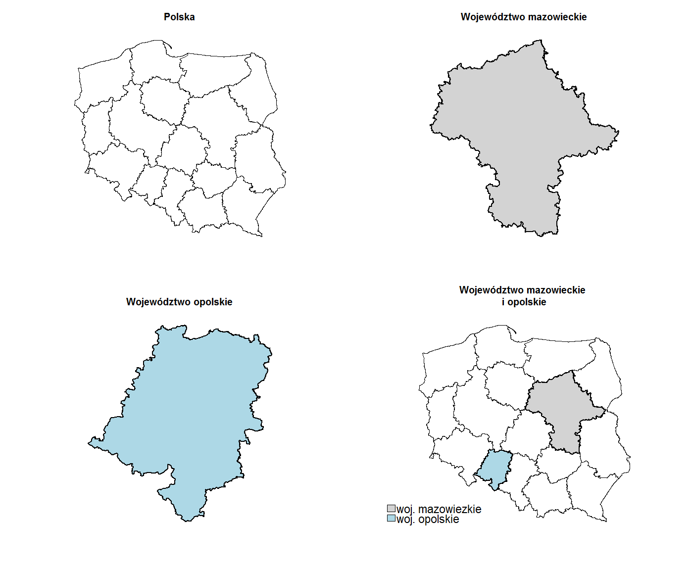
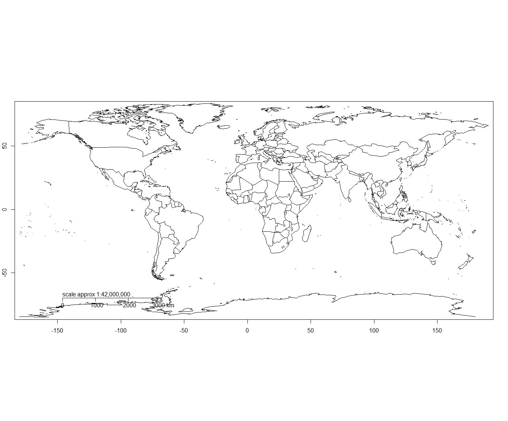
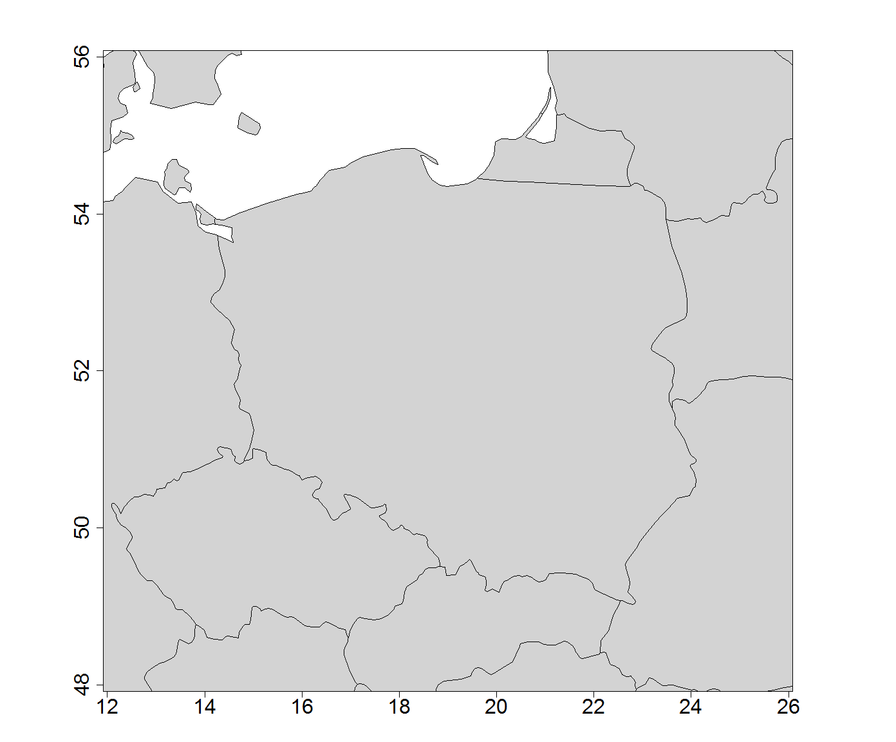
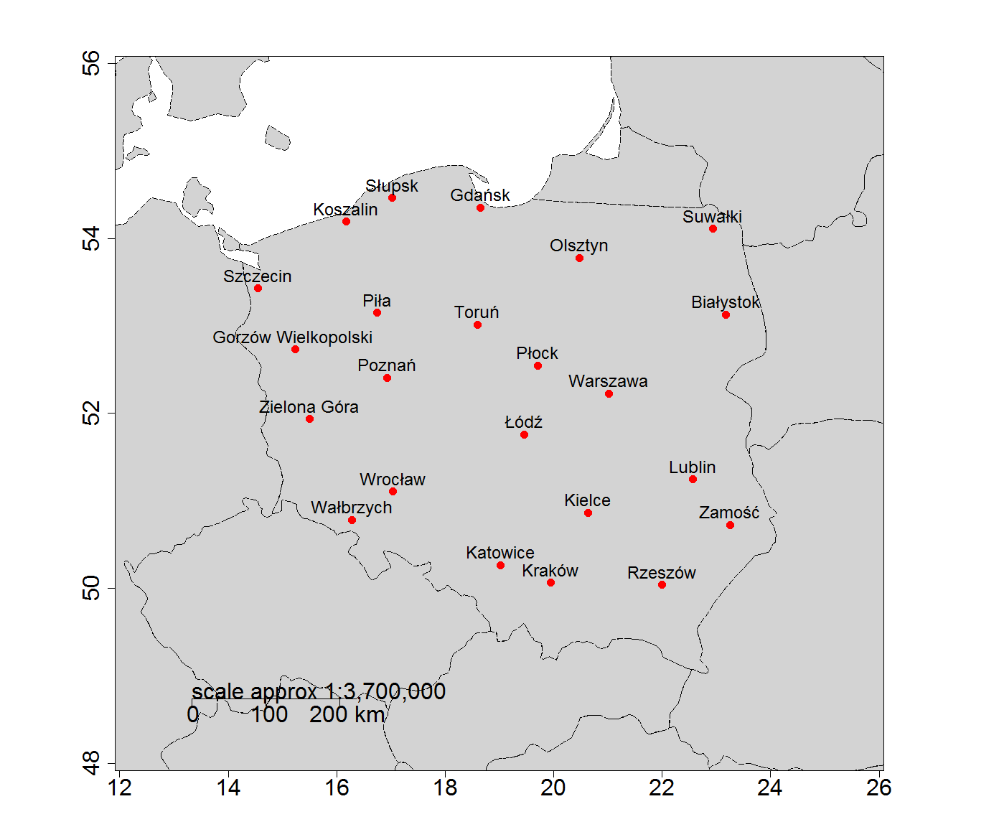

[Powrót](/index)

Wstęp
-----

Jedną z funkcjonalności pakietu statystycznego R jest możliwość analizy
danych geograficznych oraz zdolność do rysowania map danych. Pakiet R
zawiera bogaty zestaw dodatkowych bibliotek oraz funkcji kreślenia,
które można zastosować do danych przestrzennych. Zaletą jest fakt, iż
ciągle powstają nowe pakiety pozwalające na tworzenie m.in. różnego
rodzaju map. Lista wybranych pakietów do analizy danych przestrzennych
znajduje się na stronie internetowej programu statystycznego R pod
[linkiem](https://cran.r-project.org/web/views/Spatial.html) \[dostęp
28.05.2018r.\]

Pakiety pozwalające na tworzenie map
------------------------------------

Najbardziej popularne pakiety do pracy z danymi przestrzennymi to m.in.:

-   **sp** - zapewnia sposób odczytywania i wyświetlania plików typu
    *shapefile*
-   **rgeos** - zajmuje się topografią przestrzenną
-   **rgdal** - udostępnia połączenie lub dostęp do biblioteki
    abstrakcji danych geoprzestrzennych (GDAL - *Geospatial Data
    Abstraction Library*) oraz ich transformacji
-   **maptools** - zapewnia narzędzia do odczytu danych geograficznych,
    w szczególności plików *shapefile*
-   **maps** - pozwala na tworzenie prostych map i kartogramów dla
    całego świata oraz poszczególnych krajów
-   **mapdata** - uzupełnia pakiet *maps* o dodatkowe mapy
-   **mapproj** - wykonuje operacje rzutowania map
-   **maptree** - ułatwia wyświetlanie analiz drzew decyzyjnych i
    regresyjnych danych przestrzennych
-   **shapefiles** - odczytuje pliki *shapefile*

Grupa plików typu *shapefile*
-----------------------------

Wspomniane powyżej pliki *shapefile* są jednym z najczęściej spotykanych
formatów plików grafiki wektorowej. Format ten jest używany w Systemach
Informacji Geograficznej (GIS - *Geographic Information System*). Format
*shapefile* został opracowany przez firmę ESRI (*Environmental Systems
Research Institute*). W plikach o tym formacie można zapisywać obiekty
wektorowe np. punkty i linie. Każdy z tych obiektów posiada tabelę z
atrybutami, w której można umieścić parametry danych obiektów np. nazwę,
długość, powierzchnię i współrzędne.

Najczęściej zbiór danych, który jest zawarty w plikach typu *shapefile*
obejmuje zestaw minimum 3 pliki z następującymi rozszerzeniami:

-   **.shp** - zawierający szczegółowe dane o współrzędnych kształtów,
    przechowujący geometrię obiektu np. granice Polski
-   **.dbf** - przechowujący informacje (atrybuty) dotyczące kształtów
    danych obiektów w formie tabelarycznej np. nazwy województw w
    Polsce, statystyki dotyczące analizowanych krajów
-   **.shx** - służący do indeksowania danych, pozwalający na szybkie
    przeszukiwanie danych ponieważ przyspiesza odczytywanie plików z
    geometrią

Z plikiem o rozszerzeniu **.shp** muszą być połączone minimum pliki w
formatach **.dbf** oraz **.shx**. Bez nich plik nie może działać
samodzielnie. W tym celu konieczne jest, aby w jednym folderze roboczym
zlokalizowane były wspomniane trzy obowiązkowe pliki.

Opcjonalnie występujące formaty to:

-   **.prj** - plik zawierający informacje o układzie współrzędnych oraz
    ich odwzorowania
-   **.sbn, .sbx** - zawierają indeksy przestrzenne obiektów
-   **.atx** - tworzy indeksy dla atrybutów
-   **.isx, .mxs** - tworzą indeksy poprawiające geokodowanie
-   **.xml** - zawiera plik z metadanymi

Przykłady generowania map z wykorzystaniem wybranych pakietów R
---------------------------------------------------------------

Zanim zostanie wygenerowana mapa, należy pobrać zestaw plików
*shapefile* z ogólnodostępnego zbioru danych przestrzennych Centralnego
Ośrodka Dokumentacji Geodezyjnej i Kartograficznej. Zasoby na stronie
internetowej CODKiG są bezpłatne i można z nich korzystać również do
celów komercyjnych. Bezpośredni
[link](https://www.gis-support.pl/downloads/wojewodztwa.zip) \[dostęp
28.05.2018r.\] do archiwum zawierającego pliki *shapefile* dotyczące
województw w Polsce. Pliki pochodzą z Państwowego Rejestru Granic, który
jest urzędową bazą danych stanowiącą podstawę dla innych systemów
informacji przestrzennej zawierających dane dotyczące podziałów
terytorialnych Polski (m.in. przebieg granic, powierzchnię jednostek
zasadniczego podziału terytorialnego tj. gmin, powiatów oraz województw)

Kolejnym krokiem jest zainstalowanie oraz wczytanie dodatkowych
bibliotek z repozytorium *CRAN*:

Wczytanie danych przestrzennych poprzez wykorzystanie funkcji *readOGR*,
której argumentem jest plik *województwa.shp*:

W pliku znajduje się 29 atrybutów (kolumn), które opisują 16 województw.
W celu uproszczenia pracy można ograniczyć liczbę atrybutów do nazwy
województwa oraz powierzchni każdego z województw. W tym celu kolumnie
*jpt nazwa* zmieniono nazwę na *nazwa.woj* oraz kolumnie *jpt powier* na
*powierzchnia.woj*. W wyniku tego otrzymano listę z nazwami województw
oraz ich powierzchnią wyrażoną w kilometrach kwadratowych.

    ##              nazwa.woj powierzchnia.woj
    ## 0             opolskie           941272
    ## 1       świętokrzyskie          1171136
    ## 2   kujawsko-pomorskie          1797058
    ## 3          mazowieckie          3555920
    ## 4            pomorskie          1831001
    ## 5              śląskie          1233406
    ## 6  warmińsko-mazurskie          2417419
    ## 7   zachodniopomorskie          2289315
    ## 8         dolnośląskie          1994777
    ## 9        wielkopolskie          2982774
    ## 10             łódzkie          1821720
    ## 11           podlaskie          2018598
    ## 12         małopolskie          1518007
    ## 13            lubuskie          1398751
    ## 14        podkarpackie          1784523
    ## 15           lubelskie          2512291

Zastosowanie slotu *data* umożliwia stworzenie ramki danych na której
można wykonywać różnego rodzaju operacje:

    ## [1] 31267968

    ##   nazwa.woj powierzchnia.woj
    ## 0  opolskie           941272

    ##     nazwa.woj powierzchnia.woj
    ## 3 mazowieckie          3555920

    ## [1] 1954248

Wizualizację mapy Polski można wykonać przy pomocy funkcji *plot*.
Wykorzystując jej parametry można otrzymać różnego rodzaju
przekształcenia rysunku np. dodawać tytuły, zmieniać kolor wypełniający
powierzchnię lub zmieniać grubość granic. Istnieje również możliwość
wyodrębnienia wybranego województwa i stworzenia dla niego oddzielnej
mapy.

Kolejnym sposobem na wygenerowanie map jest użycie pakietów *maps* oraz
*mapdata*.

Instalacja oraz implementacja wymaganych bibliotek:

Gdy zostanie wykonana funkcja *map()* bez jakichkolwiek parametrów,
domyślnie program zwróci mapę świata z zaznaczonymi konturami wszystkich
krajów. Funkcja *map.axes* dodaje do uprzednio wczytanej mapy osie z
szerokością oraz długością geograficzną. Natomiast funkcja *map.scale*
nanosi skalę.

Wykorzystując możliwość podania współrzędnych geograficznych tj.
szerokości (parametr *xlim*) oraz długości (parametr *ylim*), można
wyodrębnić oraz pokazać dowolny fragment mapy świata. Parametr *fill*
oraz *col* dotyczą wypełnienia kolorem powierzchni krajów. Wartość
logiczna *TRUE* oznacza zastosowanie wypełnienia, a parametr *col*
określa kolor jakim ma zostać wypełniony fragment. Parametr *cex.axis* w
funkcji pokazującej osie współrzędnych odpowiada za wielkość czcionki
określającej współrzędną geograficzną.  
Poniższa sekcja kodu generuje mapę przedstawiającą Polskę wraz z krajami
sąsiednimi. Powierzchnia wszystkich krajów zamalowana została wybranym
kolorem.

Niewypełniona mapa konturowa nie wygląda atrakcyjnie. Dzięki funkcji
*points* istnieje możliwość naniesienia punktów na podstawie
współrzędnych geograficznych. Etykiety punktów tj. nazwy miast zostały
przypisane poprzez funkcję *text*, która współgra z funkcją *points*.
Dana funkcja odwołuje się do odpowiedniej kolumny we wczytanej ramce
danych z nazwami miast i ich współrzędnymi. Ramka danych została
wczytana na podstawie stworzonego pliku z rozszerzeniem *.csv*
zawierającego wspomniane elementy. Współrzędne wybranych miast w Polsce
zostały pobrane ze [strony internetowej](https://www.wspolrzedne.pl/).

Współrzędne geograficzne podawane przez ten serwis internetowy to
współrzędne w formacie *DMS* (stopnie, minuty, sekundy) oraz w formacie
*DD* (stopnie dziesiętne), gdzie separatorem dziesiętnym jest kropka. Na
potrzeby pracy wykorzystany został format *DD*.

Stworzony plik *.csv* zawiera nagłówki, a separatorem kolumn jest
średnik. Ramka danych z wybranymi największymi miastami w Polsce wygląda
następująco:

    ##             Miejscowość        x        y
    ## 1              Warszawa 21.01223 52.22968
    ## 2              Katowice 19.02378 50.26489
    ## 3                Kraków 19.94498 50.06465
    ## 4               Wrocław 17.03854 51.10789
    ## 5              Szczecin 14.55281 53.42854
    ## 6                Gdańsk 18.64664 54.35203
    ## 7                Kielce 20.62857 50.86608
    ## 8                Poznań 16.92517 52.40637
    ## 9             Białystok 23.16884 53.13249
    ## 10                 Łódź 19.45598 51.75925
    ## 11               Lublin 22.56845 51.24645
    ## 12              Olsztyn 20.48012 53.77842
    ## 13              Rzeszów 21.99912 50.04119
    ## 14            Wałbrzych 16.28436 50.78401
    ## 15             Koszalin 16.17149 54.19432
    ## 16               Słupsk 17.02848 54.46415
    ## 17                Toruń 18.59844 53.01379
    ## 18 Gorzów Wielkopolski  15.23693 52.73253
    ## 19              Suwałki 22.93079 54.11152
    ## 20               Zamość 23.25197 50.72309
    ## 21         Zielona Góra 15.50619 51.93562
    ## 22                 Piła 16.73823 53.15097
    ## 23                Płock 19.70654 52.54634

Kolejna sekcja kodu wykonuje polecenie naniesienia punktów wraz z
etykietami danych na podstawie współrzędnych geograficznych pobranych z
ramki danych. Parametry *cex* określają wielkość tekstu etykiet,
wielkość punktów oraz wielkość cyfr naniesionych na skalę osi
współrzędnych geograficznych. Parametr *pos* określa miejsce
umieszczenia etykiety w stosunku do położenia punktu (tu: wartość 3
oznacza umieszczenie tekstu nad punktem). Parametr *pch* określa kształt
punktu (zamalowana kropka), natomiast *col* jego kolor (czerwony).
Ostateczny wygląd mapy:

Podsumowanie
---------------------------------------------------------------

Możliwości przedstawienia różnego rodzaju zjawisk na wygenerowanych
mapach w pakiecie statystycznym R są praktycznie nieograniczone.
Niewątpliwym atutem tego programu jest dostępność wielu bibliotek z
funkcjami, które umożliwiają stworzenie różnego rodzaju map oraz analizę
danych geograficznych w zależności od potrzeb. Praca miała na celu
pokazanie podstawowych możliwości jakie oferuje pakiet statystyczny R w
zakresie tworzenia map geograficznych.

Bibliografia
---------------------------------------------------------------

-   Anderson E. C., *Making maps with R* \[online:\]
    <a href="http://eriqande.github.io/rep-res-web/lectures/making-maps-with-R.html" class="uri">http://eriqande.github.io/rep-res-web/lectures/making-maps-with-R.html</a>
-   Bivand R., *Applied Spatial Data Analysis with R* \[online:\]
    <a href="http://geog.uoregon.edu/bartlein/courses/geog495/lec06.html" class="uri">http://geog.uoregon.edu/bartlein/courses/geog495/lec06.html</a>
-   Lawrence R., Cheshire J., Oldroyd R., *Introuction to visualising
    spatial data in R* \[online:\]
    <a href="https://cran.r-project.org/doc/contrib/intro-spatial-rl.pdf" class="uri">https://cran.r-project.org/doc/contrib/intro-spatial-rl.pdf</a>
-   Strona internetowa pakietu statystycznego R:
    <a href="https://cran.r-project.org/web/views/Spatial.html" class="uri">https://cran.r-project.org/web/views/Spatial.html</a>

Wykorzystane zbiory danych
---------------------------------------------------------------

-   Pliki *shapefile* zostały pobrane ze strony internetowej Centralnego
    Ośrodka Dokumentacji Geodezyjnej i Kartograficznej:
    <a href="https://www.gis-support.pl/downloads/wojewodztwa.zip" class="uri">https://www.gis-support.pl/downloads/wojewodztwa.zip</a>

-   Współrzędne wybranych miast w Polsce zostały pozyskane ze strony
    internetowej:
    <a href="https://www.wspolrzedne.pl/" class="uri">https://www.wspolrzedne.pl/</a>

[Powrót](/index)
