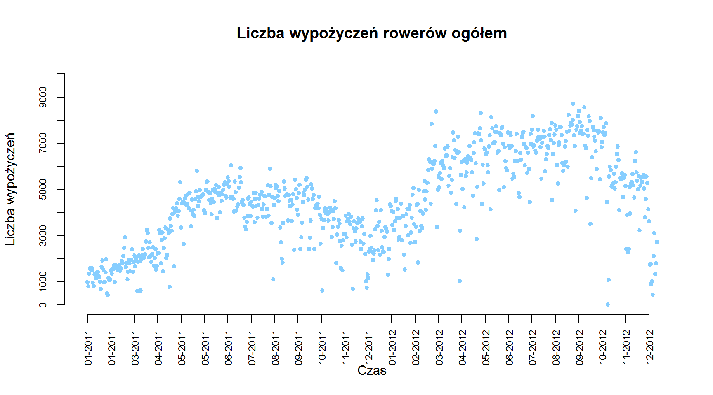
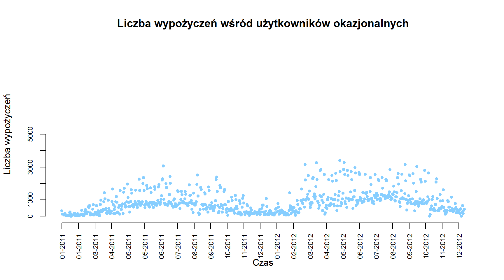
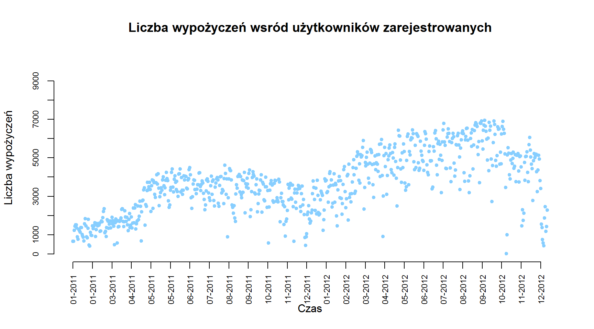
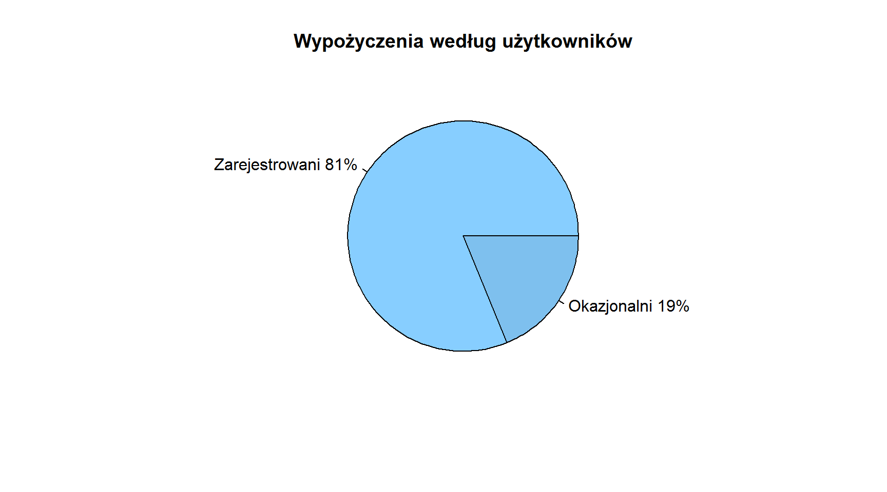
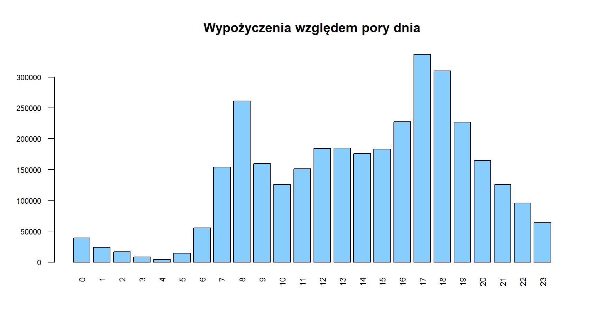
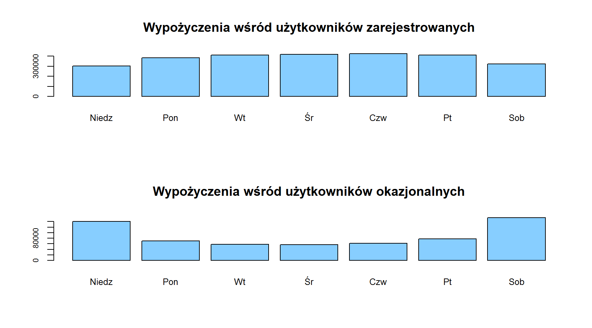
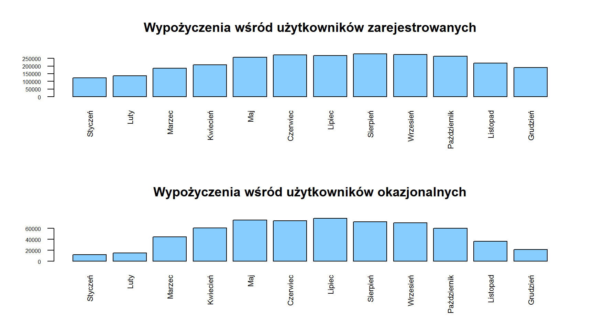
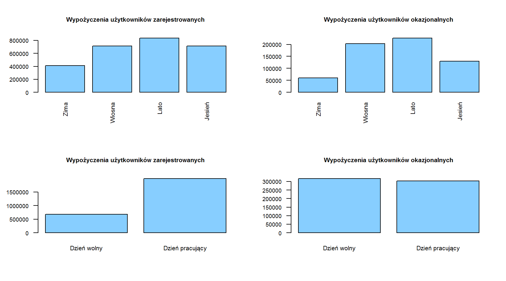
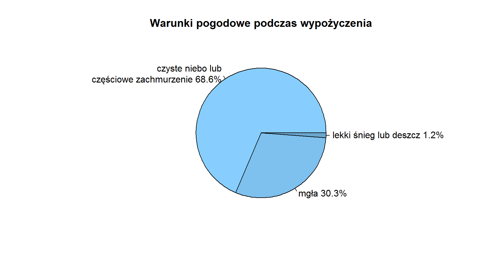
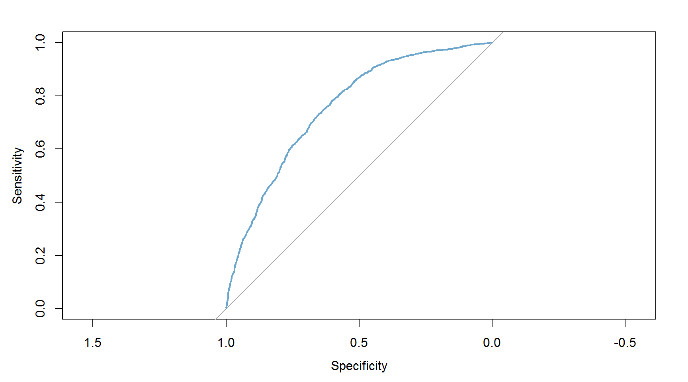

### **1. Źródło danych**

#### **1.1. Informacje o źródle** 

Dane do analizy zostały pobrane z ogólnodostępnego repozytorium zbiorów
danych UC Irvine Machine Learning Repository (UCI). Bezpośredni
[link](http://archive.ics.uci.edu/ml/datasets/Bike+Sharing+Dataset) do
zbioru danych.

#### **1.2. Pliki ze zbiorami danych**

W powyższym linku do repozytorium UCI znajdują się dwa pliki o
rozszerzeniu *.csv* ze zbiorami danych. Przperowadzono analizę z
wykorzystaniem obydwu zbiorów danych:

1.  plik **day.csv** zawierający dane dotyczące wypożyczeń rowerów
    zagregowane według dni. Liczba obserwacji obejmuje 731 dni.
2.  plik **hour.csv** zawierający dane dotyczące wypożyczeń rowerów w
    poszczególnych dniach zagregowane według godzin. Liczba obserwacji
    obejmuje 17 379 godzin.

#### **1.3. Zawartość zbiorów danych**

Zarówno zbiór **hour.csv**, jak i **day.csv** zawierają taki sam zestaw
zmiennych. Jednyną różnicą jest dodatkowa zmienna *hr*, która określa
godzinę wypożyczenia roweru w zbiorze *hour*.

Zakres danych obejmuje dzienne obserwacje począwszy od 1 stycznia 2011
roku do 31 grudnia 2012 roku. Dane pochodzą z systemu wypożyczalni
*Capital Bikeshare* w Waszyngtonie w USA.

Charakterystyka zbiorów danych:

-   ***instant*** - numer obserwacji
-   ***dteday*** - data wypożyczenia roweru
-   ***season*** - pora roku, gdzie:
    -   1 - wiosna
    -   2 - lato
    -   3 - jesień
    -   4 - zima
-   ***yr*** - rok, zmienna dychotomiczna:
    -   0 - rok 2011
    -   1 - rok 2012
-   ***mnth*** - miesiąc od 1 do 12, gdzie:
    -   1 - styczeń
    -   2 - luty
    -   …
    -   11 - listopad
    -   12 - grudzień
-   ***hr*** - godzina od godziny 0 do godziny 23
-   ***holiday*** - święto, zmienna dychotomiczna:
    -   1 - dany dzień jest dniem świątecznym
    -   0 - dany dzień nie jest dniem świątecznym *Kalendarz dni
        świątecznych dotyczy USA. Dane według [strony
        internetowej](http://dchr.dc.gov/page/holiday-schedule)*
-   ***weekday*** - dzień tygodnia, gdzie:
    -   0 - niedziela
    -   1 - poniedziałek
    -   …
    -   5 - piątek
    -   6 - sobota
-   ***workingday*** - dzień pracujący, zmienna dychotomiczna:
    -   1 - dany dzień jest dniem pracującym
    -   0 - dany dzień wypada w weekend lub jest to dzień świąteczny
-   ***weathersit*** - warunki atmosferyczne:
    -   1 - czyste niebo lub częściowe zachmurzenie
    -   2 - mgła
    -   3 - lekki śnieg lub deszcz
    -   4 - ciężki śnieg lub deszcz, grad, burza
-   ***temp*** - Temperatura w stopniach Celsjusza poddana
    standaryzacji. Wartość min -8, max +39  
-   ***atemp*** - Odczuwana temperatura w stopniach Celsjusza poddana
    standaryzacji. Wartość min -16, max +50  
-   ***hum*** - Standaryzowana wilgotność powietrza. Wartość max 100
-   ***windspeed*** - Standaryzowana prędkość wiatru. Wartość max 67
-   ***casual*** - liczba wypożyczeń przez
    przypadkowych/niezarejestrowanych użytkowników
-   ***registered*** - liczba wypożyczeń przez zarejestrowanych
    użytkowników
-   ***cnt*** - liczba wypożyczeń przez użytkowników niezarejestrowanych
    oraz zarejestrowanych

### **2. Opis analizowanego zagadnienia**

Liczba wypożyczeń rowerów publicznych jest ściśle skorelowana z
warunkami środowiskowymi i sezonowymi. Czynnikami wpływającymi na liczbę
wypożyczeń mogą być m.in.: opady atmosferyczne, temperatura powietrza,
pora roku, pora dnia, czy dzień tygodnia.

System rowerów publicznych to nowa generacja tradycyjnych wypożyczalni
rowerów. Przewagą nad tradycyjnymi wypożyczalniami rowerów jest proces
rejestracji nowego użytkownika, wypożyczenie oraz zwrot roweru, bowiem
wszystko to zostało w pełni zautomatyzowane. Dzięki temu, użytkownik
może w bardzo prosty sposób wypożyczyć rower z określonej lokalizacji i
oddać go z powrotem w innej.

Obecnie można zaobserwować wzrost zainteresowania rowerami publicznymi,
których proces wypożyczania staje się coraz prostszy i wygodniejszy. Co
więcej, opłaty za wypożyczenie nie są zbyt wysokie. Dodatkowym atutem
jest aktywność fizyczna i kwestie zdrowotne oraz troska o jakość
powietrza w wielkich miastach, ponieważ rower nie emituje jakichkolwiek
spalin, które zanieczyszczają środowisko.

Oprócz aspektów zdrowotnych oraz środowiskowych, z rowerami publiczymi
związany jest również aspekt ekonomiczny. Analiza liczby wypożyczeń może
dać odpowiedź na pytania dotyczące strategii obranych przez firmy
zarządzające danymi wypożyczalniami. Czy warto stworzyć nowy punkt w
okolicy najczęściej używanej lokalizacji? Czy liczba rowerów jest
wystarczająca? Jaka pora roku lub dnia jest najlepsza na wypożyczenie
roweru? Czy rośnie liczba zarejestrowanych użytkowników lub tych
okazjonalnych? To tylko przykładowe pytania, na które odpowiedzi mogą
wskazać kierunek rozwoju systemów wypożyczalni rowerów publicznych w
miastach. Dodatkowo, charakterystyka danych generowanych przez te
systemy, czyni je atrakcyjnymi do analiz. W przeciwieństwie do innych
usług transportowych, takich jak autobus lub metro, czas trwania i
miejsce podróży są rejestrowane w tych systemach. Ta funkcja zamienia
system wypożyczania rowerów w wirtualną sieć czujników, która może
służyć np. do wykrywania mobilności w mieście.

### **3. Cel analizy oraz pytania badawcze**

Celem analizy jest scharakteryzowanie systemu wypożyczalni rowerów
publicznych w Waszyngtonie w latach 2011-2012.

Postawiono następujące pytania badawcze:

-   Jaka jest tendencja w liczbie wypożyczeń rowerów publicznych?
-   Jak kształtuje się struktura liczby użytkowników systemu?
-   Jak rozkłada się liczba wypożyczeń względem pory dnia, dni tygodnia,
    miesięcy i pór roku?
-   Czy w dni wolne od pracy ludzie chętnie wypożyczają rowery?
-   Czy warunki pogodowe mają wpływ na liczbę wypożyczeń?
-   Jakie czynniki mają największy wpływ na fakt wypożyczenia roweru lub
    nie?

### **4. Wstępna analiza danych**

##### **Rysunek 1.** Tendencja w liczbie wypożyczeń rowerów publicznych wśród użytkowników ogółem

Liczba wypożyczeń rowerów publicznych ogółem w latach 2011-2012
charakteryzowała się trendem rosnącym. Widoczny jest on względem
mięsięcy maj-wrzesień rok do roku. Również widoczny wzrost w liczbie
wypożyczeń w pierwszych miesiącach roku tj. styczeń-marzec, gdzie
zjawisko to wzrosło średnio o około 1500. Średnio najwięcej wypożyczeń
rowerów ogółem zarejstrowano w miesiącach letnich, gdy temperatura
sprzyja przemieszczaniu się środkiem transportu jakim jest rower. W roku
2011 średnio najwięcej wypożyczano rowery 5000 razy. Natomiast w roku
2012 najwięcej wypożyczano około 7000 razy.

##### **Rysunek 2.** Tendencja w liczbie wypożyczeń rowerów publicznych wśród użytkowników okazjonalnych

Liczba wypożyczeń przez użytkowników, którzy wypożyczają rowery
okazyjnie średnio oscylowała na poziomie około 1000 w roku 2011, a w
2012 około 1500 razy. Wzrost liczby wypożyczeń w tej kategorii
użykowników nie jest wyraźny. Wyraźny jest wzrost wartości obserwacji
odstających, które wzrosły z poziomu około 2000 w miesiącach
maj-wrzesień roku 2011 do poziomu około 2000 wypożyczeń w okresie
maj-wrzesień 2012 roku. Co więcej, wysokie wartości odstające zostały
zaobserwowane w 2012 roku trochę wcześniej, bowiem już w marcu.

##### **Rysunek 3.** Tendencja w liczbie wypożyczeń rowerów publicznych wśród użytkowników zarejstrowanych

Powyższy wykres wskazuje, że grupa użytkowników, którzy są zarejstrowani
w systemie rowerów publicznych chętniej wypożycza rowery, niż grupa
użytkowników okazjonalnych, nieposiadających konta. Użytkownicy
zarejstrowani wykazują zainteresowanie dalszym wypożyczaniem rowerów,
ponieważ zauważalna jest wyraźna tendencja rosnąca. Średnio najwięcej
razy użytkownicy zarejestrowani wypożyczali rowery w 2011 roku w
miesiącach maj-wrzesień. W roku 2012 okres ten został wydłużony od marca
do października. Dodatkowo w październiku zarejstrowano największą
liczbę wypożyczeń. Podsumowując, nastapił wzrost średniego poziomu
wypożyczeń rowerów oraz użytkownicy zarejestrowani zaczęli częściej
wypożyczać rowery i wydłużyli ten okres w 2012 roku, niż w roku
poprzednim.

##### **Rysunek 4.** Struktura użytkowników systemu wypożyczeń rowerów publicznych

Powyższy wykres wskazuje wyraźną przewagę użytkowników korzystajacych z
systemu wypożyczalni rowerów publicznych, którzy są w nim zarejsertowani
od tych, którzy nie posiadają konta i wypozyczają rowery okazjonalnie.
Użytkownicy zarejstrowani w latach 2011-2012 stanowili łącznie 81%
wszystkich wypożyczeń, natomiast użytkownicy okazjonalni tylko 19%.
Łącznie w latach 2011-2012 wypożyczano rowery 3292679 razy, w tym
użytkownicy zarejestrowani 2672662, a okazjonalni 620017 razy.

##### **Rysunek 5.** Rozkład wypożyczeń ogółem względem pory dnia

Wykres pokazuje w jakich porach dnia w latach 2011-2012 nastąpiła
największa liczba wypożyczeń rowerów wśród użytkowników ogółem. Można
zaobserwować dwie pory dnia, które wyróżniają się w ciągu całej doby. Są
to “szczyty komunikacyjne” - poranny w godzinach 7-9 oraz popołudniowy w
godzinach 16-19. Przy czym najczęściej w tych porach dnia rowery były
wypożyczane o godzinie 8 oraz 17 i 18. Można przypuszczać, że rowery
oprócz aspektów rekreacyjnych stanowią dogodny środek komunikacji do
pracy, szkoły lub do domu. Warto również zaznaczyć, że w szczycie
popołudniowym średnio częściej wypożyczane były rowery niż w szczycie
porannym. Najrzadziej wypożycza się rowery w nocy/nad ranem w godzinach
3-4, bowiem wtedy ruch w systemie wypożyczalni jest najmniejszy. W ciągu
dnia pomiędzy szczytami komunikacyjnymi, ruch w wypożyczalni rośnie do
okolic południa, po tym delikatnie się zmniejsza, żeby znacznie wzrastać
od godziny 16.

##### **Rysunek 6.** Rozkład wypożyczeń rowerów względem dnia tygodnia z podziałem na rodzaj użytkowników

Wykresy pokazują wyraźną różnicę pomiędzy użytkownikami, którzy są
zarejestrowani w systemie wypożyczalni oraz tymi, którzy korzystają z
rowerów okazjonalnie. Użytkownicy zarejestrowani wypożyczają rowery
najczęściej w pracujące dni tygodnia, przy czym w weekend nieznacznie
mniej. Natomiast użytkownicy okazjonalni wypożyczają rowery głównie w
weekendy, a liczba wypożyczeń w dni pracujące jest znacząco niższa.

##### **Rysunek 7.** Rozkład wypożyczeń rowerów według rodzaju użytkowników względem miesiąca

Kolejna grupa wykresów pokauzje różnice między typami użytkowników w
systemie wypożyczalni. Użytkownicy zarejestrowani regularnie wypożyczją
rowery w ciagu roku. Najczęściej wypożyczają oni w miesiącach
maj-październik. W pozostałych miesiącach różnica jest nieznaczna. Z
drugiej strony użytkownicy okazjonalni najchętniej decydują się na
wypożyczenie roweru w miesiącach marzec-październik. Jednakże w znaczący
sposób rezygnują oni z wypożyczania rowerów w pozostałe miesiące. Można
wyciągnąć z tego wniosek, że użytkownicy zarejestrowani są bardziej
lojalni wobec wypożyczalni i starają się korzystać z tej usługi przez
cały rok. Natomiast użytkownicy okazjonalni, jak sama nazwa wskazuje,
korzystają z wypożyczalni okazyjnie. Z pewnością jest to uwarunkowane
przez warunki pogodowe i porę roku.

##### **Rysunek 8.** Rozkład wypożyczeń rowerów według rodzaju użytkowników wzglem pory roku

Kolejne wykresy to uzupełnienie oraz potwierdzenie analiz wykonanych
wcześniej. Ogółem ludzie częściej decydują się na wypożyczenie rowerów
na wiosnę oraz w lecie. Wobec pozostałych pór roku, użytkownicy
zarejestrowani wypożyczają rowery częściej niż okazjonalni. Również
użytkownicy zarejestrowani wypożyczają rowery częściej w dni pracujące.
Natomiast użytkownicy okazjonalni niewiele więcej decydują się na
wypożyczenie roweru w dzień wolny od pracy.

##### **Rysunek 9.** Struktura wypożyczeń rowerów według warunków pogodowych

Najczęściej rowery były wypożyczane, gdy warunki atmosferyczne były
bardzo dobre tj. było czyste niebo lub niewielkie, częściowe
zachmuerzenie. Takie warunki pogoodwe panowały podczas prawie 70%
wypożyczeń ogółem. W przypadku występowania mgły, wypożyczenia stanowiły
niewiele ponad 30%. Znikomy udział (1,2%) w liczbie wypożyczeń stanowią
wypożyczenia podczas lekkich opadów deszczu lub śniegu. Natomiast 0% to
wypożyczenia podczas ciężkich opadów śniegu lub deszczu, gradu i burzy
(w opisie zbioru danych występują cztery kategorie warunków
atmosferycznych). Biorąc to wszystko pod uwagę, można wnioskować, że
pogoda ma istotny wpływ na decyzję o wypożyczeniu roweru.

Jednocześnie można sprawdzić ile dni w ciągu dwóch lat obserwacji miały
poszczególne kategorie warunków pogodowych. Najwięcej było dni z
bezchmurnym niebem lub niewielkim zachmurzeniem. Z drugiej strony nie
wystąpiły ciężkie opady deszczu, śniegu lub gradu i burzy.

    ##                                      summary.atmo.
    ## czyste niebo, częściowe zachmurzenie           463
    ## mgła                                           247
    ## lekki śnieg lub deszcz                          21
    ## ciężki śnieg lub deszcz, grad, burza             0

A tak rozkładała się liczba wypożyczeń z uwzględnieniem poszczególnych
warunków atmosferycznych.

    ##                                Group.1       x
    ## 1 czyste niebo, częściowe zachmurzenie 2257952
    ## 2                                 mgła  996858
    ## 3               lekki śnieg lub deszcz   37869

### **5. Zaawansowana analiza zjawiska - regresja logistyczna**

Analiza za pomocą narzędzia regresji logistycznej miała na celu
sprawdzenie, które z wybranych czynników mają największy wpływ na
wypożyczenie rowerów. W tym celu zmienna *cnt* została zdychotomizowana
na wartości (0,1) na podstawie podziału według kwartyla 0.75. Obserwacje
równe lub poniżej wartości kwartyla 0.75 zostały oznaczone jako 0,
natomiast powyżej kwartyla 0.75 jako 1. Zbiór zmiennych niezależnych
stanowią zmienne jakościowe oraz ilościowe.

#### **5.1. Wybór zmiennych niezależnych**

Wybrano następujący zestaw zmiennych, które zostały poddane analizie pod
względem wprowadzenia do modelu:

-   ***season*** - pora roku
-   ***mnth*** - miesiąc
-   ***hr*** - godzina
-   ***holiday*** - święto
-   ***weekday*** - dzień tygodnia
-   ***workingday*** - dzień pracujący
-   ***weathersit*** - warunki atmosferyczne
-   ***temp*** - Temperatura w stopniach Celsjusza poddana
    standaryzacji. Wartość min -8, max +39  
-   ***atemp*** - standaryzowana odczuwana temperatura
-   ***hum*** - standaryzowana wilgotność powietrza
-   ***windspeed*** - standaryzowana prędkość wiatru

#### **5.2. Model funkcji logistycznej**

Funckja *glm()* wyznaczyła współczynniki w modelu uogólnionych modeli
liniowych (GLM - *Generalized Linear Models*). Parametr *binomial*
dotyczy rodziny rozkładów dwumianowych, który spowoduje otrzymanie
modleu regresji logistycznej.

Wywołanie funkcji regresji logistycznej oraz wygenerowanie podsumowań
wyników różnych funckji dopasowujących model.

    ## 
    ## Call:
    ## glm(formula = cnt ~ season + hr + holiday + weekday + workingday + 
    ##     weathersit + temp + atemp + hum + windspeed, family = "binomial", 
    ##     data = h.train)
    ## 
    ## Deviance Residuals: 
    ##     Min       1Q   Median       3Q      Max  
    ## -2.1603  -0.9800   0.4962   0.9747   2.2354  
    ## 
    ## Coefficients:
    ##              Estimate Std. Error z value Pr(>|z|)    
    ## (Intercept) -1.856397   0.126958 -14.622  < 2e-16 ***
    ## season       0.525189   0.019064  27.548  < 2e-16 ***
    ## hr           0.038246   0.002945  12.987  < 2e-16 ***
    ## holiday     -0.137849   0.122016  -1.130 0.258574    
    ## weekday     -0.005064   0.009782  -0.518 0.604662    
    ## workingday  -0.144393   0.043392  -3.328 0.000876 ***
    ## weathersit   0.027912   0.034049   0.820 0.412361    
    ## temp         2.559251   0.684223   3.740 0.000184 ***
    ## atemp        0.201989   0.766466   0.264 0.792140    
    ## hum         -1.779898   0.124963 -14.243  < 2e-16 ***
    ## windspeed   -0.314283   0.173530  -1.811 0.070123 .  
    ## ---
    ## Signif. codes:  0 '***' 0.001 '**' 0.01 '*' 0.05 '.' 0.1 ' ' 1
    ## 
    ## (Dispersion parameter for binomial family taken to be 1)
    ## 
    ##     Null deviance: 18068  on 13033  degrees of freedom
    ## Residual deviance: 15455  on 13023  degrees of freedom
    ## AIC: 15477
    ## 
    ## Number of Fisher Scoring iterations: 4

Na początku wywołanego podsumowania wyników, przedstawione są reszty
dewiancyjne tj. minimum, maksimum oraz kwartyle. Dalej pokazane zostały
oceny współczynników dla kolejnych zmiennych objaśniających i odchylenia
standardowe tych ocen. Kolejną kolumnę w tabeli wyników stanowią
wartości statystyki testowej dla testu z hipotezą zerową dotyczącą
nieistotności danej zmiennej w modelu wraz z wartością *p-value* dla
tego testu. Im mniejsze wartości przyjmuje wartość *p-value*, tym dana
zmienna jest bardziej istotniejsza. Dla uproszczenia interpretacji,
funkcja graficznie przedstawia to za pomocą symbolu gwiazdek po prawej
stronie. Maksymalnie wyświetlane są trzy gwiazdki, które oznaczają, że
dana zmienna najlepiej opisuje przyjęty model.

W oszacowanym modelu zostały wybrane zmienne, które pod względem
statystycznym najlepiej opisują korzystanie z wypożyczalni rowerów
publicznych. Są to:

-   ***season*** - pora roku
-   ***hr*** - godzina
-   ***holiday*** - święto
-   ***workingday*** - dzień pracujący
-   ***temp*** - temperatura  
-   ***hum*** - wilgotność powietrza
-   ***windspeed*** - prędkość wiatru

Dodatkowo zostały określone wartości dewiancji zerowej i resztowej
kryterium informacyjnego Akaike’a (*AIC*), którego wartość wyniosła
15477.17. Kryterium *AIC* jest tutaj określane jako miara dobroci
dopasowania. Algorytm estymujący współczynniki metodą *Fishera*
(najmniejszych ważonych kwadratów) został iterowany 4 razy.

Następnie można uzyskać wartości wyestymowanych współczynników przy
danych zmiennych, którymi można opisać model określający wypożyczanie
rowerów publicznych.

    ##  (Intercept)       season           hr      holiday      weekday   workingday 
    ## -1.856397251  0.525188514  0.038245623 -0.137849262 -0.005064297 -0.144392617 
    ##   weathersit         temp        atemp          hum    windspeed 
    ##  0.027911555  2.559250524  0.201988994 -1.779897687 -0.314282941

*Fitted.values* zwraca wartości prawdopodobieństw “sukcesu”
(oznaczającego wypożyczenie roweru), które zostały dopasowane przez
model dla każdej z prób w zbiorze treningowym. *Linear.predictors*
pokazuje dla każdej z prób wartości dopasowane przez model przed
przekształceniem przez wiążącą funkcję. Natomiast *residuals* ukazuje
reszty dla każdej z prób. Na potrzeby raportu, przedstawiono po sześć
pierwszych obserwacji ze zbiorów wynikowych podanych współczynników.

    ##      6044      5958     11545      5287      3209      9047 
    ## 0.5619439 0.7839999 0.3563202 0.5784468 0.4360412 0.3412433

    ##       6044       5958      11545       5287       3209       9047 
    ##  0.2490551  1.2891302 -0.5913715  0.3164005 -0.2572444 -0.6577584

    ##      6044      5958     11545      5287      3209      9047 
    ## -2.282813  1.275510 -1.553568 -2.372180 -1.773179 -1.518011

#### **5.3. Weryfikacja modelu regresji logistycznej**

Sprawdzenie dokładności modelu można wykonać przy pomocy *confusion
matrix*. Wszystkie statystyki dotyczące tej macierzy przedstawione
zostały poniżej. Pod względem dokładności modelu interesująca będzie
statystyka *AUC*, która wskazuje na dokładność modelu rzędu 0.6868.

    ## Confusion Matrix and Statistics
    ## 
    ##           Reference
    ## Prediction    0    1
    ##          0 1127  315
    ##          1 1046 1857
    ##                                           
    ##                Accuracy : 0.6868          
    ##                  95% CI : (0.6727, 0.7005)
    ##     No Information Rate : 0.5001          
    ##     P-Value [Acc > NIR] : < 2.2e-16       
    ##                                           
    ##                   Kappa : 0.3736          
    ##                                           
    ##  Mcnemar's Test P-Value : < 2.2e-16       
    ##                                           
    ##             Sensitivity : 0.5186          
    ##             Specificity : 0.8550          
    ##          Pos Pred Value : 0.7816          
    ##          Neg Pred Value : 0.6397          
    ##              Prevalence : 0.5001          
    ##          Detection Rate : 0.2594          
    ##    Detection Prevalence : 0.3319          
    ##       Balanced Accuracy : 0.6868          
    ##                                           
    ##        'Positive' Class : 0               
    ## 

Dokładność modelu można również otrzymać w następujący sposób: należy
dodać wartości zwrócone przez macierz przy wynikach dających
jednoznaczną odpowiedź tzn. wypożyczenie roweru lub nie. Dodane zostaną
wartości dla komórek w macierzy (0,0) oraz (1,1), a następnie podzielić
przez sumę wszystkich wartości komórek z macierzy.

    ##           Reference
    ## Prediction    0    1
    ##          0 1127  315
    ##          1 1046 1857

Oznacza to, że dokładność modelu na zbiorze testowym wynosi 0.6867664.
Można stwierdzić, że opracowany model w około 68% przypadków prawidłowo
przewidzi decyzję dotyczącą wypożyczenia roweru lub nie, oczywiście przy
danych okolicznościach tj. warunkach.

Również na zbiorze treningowym dokładność modelu była na bardzo podobnym
poziomie, przy ustalonym progu odcięcia równym 0.4. Macierz błędu dla
zbioru treningowego prezentuje się następująco:

    ##    
    ##     FALSE TRUE
    ##   0  3337 3112
    ##   1   964 5621

Na podstawie macierzy, można ustalić, że model prawidłowo rozpoznaje
68.73% przypadków na zbiorze treningowym.

Kolejnym sposobem na wykonanie sprawdzenia efektywności modelu
predykcyjnego jest wykreślenie krzywej ROC. Krzywa odpowiada za macierz
błędu, która powstaje poprzez modyfikacje punktów odcięcia. Inaczej
mówiąc, jest funkcją punktu odcięcia.

##### **Rysunek 10.** Krzywa ROC dla opracowanego modelu regresji logistycznej

Krzywą ROC interpertuje się następująco: najbardziej pożądaną jest
maksymalna wartość pola powierzchni pomiędzy krzywą ROC, a prostą
ustaloną jako klasyfikator losowy. Natomiast klasyfikator idealny to
punkt, gdzie czułość (*sensitivity*) wynosi 1 i specyficzność
(*specificity*) ma wartość 0. W przypadku tego modelu pole powierzchni
stanowi 0.7566631 “idealności”. Oznacza to, że model około w 76%
poprawnie sklasyfikuje decyzję o wypożyczeniu roweru lub nie na
podstawie zestawu zmiennych diagnostycznych, które zostały do modelu
wprowadzone.

### **6. Podsumowanie i wnioski płynące z analizy**

Dzięki przeprowadzonej analizie dotyczącej systemu wypożyczalni rowerów
publicznych w Waszyngtonie można wyciągnąć następujące wnioski:

1.  W latach 2011-2012 nastąpił znaczący wzrost w liczbie wypożyczeń\*\*
    rowerów w Waszyngtonie.
2.  Znaczący udział we wzroście mają użytkownicy zarejestrowani.
3.  Użytkownicy posiadający konto w serwisie znacznie częściej
    wypożyczają rowery od użytkownikóW okazjonalnych. W strukturze
    wypożyczeń ogółem stanowią oni 81%, a okazjonalni 19%.
4.  Rowery najczęściej wypożyczane są rano w godzinach 7-9 oraz późnym
    południem w godzinach 16-19. Te dwie pory dnia można określić jako
    szczyty komunikacyjne. Oznacza to, że rower w Waszyngtonie jest
    bardzo popularnym środkiem transportu do przemieszczania się na
    przykład rano z domu do pracy lub szkoły oraz popołudniu w drodze
    powrotnej. Przy czym w szczycie popołudniowym rowery wybierane są
    częściej niż rano.
5.  Zarejestrowani użytkownicy częściej korzystają z rowerów w pracujące
    dni tygodnia. Natomiast w weekendy ich aktywność nieznacznie maleje.
    Z kolei w przypadku okazjonalnych, różnica pomiędzy dniami
    pracującymi, a weekednami jest wyraźna. W dni wolne od pracy
    wypożyczają oni rowery znacznie częściej niż w dni powszednie. Może
    oznaczać to fakt, że zarejestrowani wykorzystują rower jako środek
    transportu w ciągu tygodnia, a w czasie weekednów korzystają z nich
    rekreacyjnie. Okazjonalni najprawdopodobniej wykorzystują rowery
    tylko w celach rekreacyjnych.
6.  Wypożyczanie rowerów charakteryzuje się sezonowością w przypadku
    miesięcy oraz pór roku. Między kwietniem, a październikiem można
    zaobserwować większy ruch w systemie wypożyczalni. Co za tym idzie,
    najwięcej rowerów wypożycza się na wiosnę i lato.
7.  Warunki atmosferyczne mają wpływ na to, czy ktoś zdecyduje się na
    wypożyczenie roweru. Najczęściej rowery wypożyczane były podczas
    warunków pogodowych sklasyfikowanych jako *czyste niebo lub
    częściowe zachmurzenie*. Stanowiło to wtedy około 68% wszystkich
    wypożyczeń. Najmniejszy ruch w wypożyczalni odnotowywany był, gdy
    padał *lekki śnieg lub deszcz* (niewiele ponad 1% wypożyczeń)
8.  Przeprowadzony proces regresji logistycznej pokazał jakie czynniki
    mają największy wpływ na to, czy użytkownik (zarówno zarejestrowany
    i okazjonalny) podejmie decyzję o wypożyczeniu roweru. Największy
    wpływ mają m.in. czynniki atmosferyczne: temperatura, wilgotność
    powietrza, prędkość wiatru, a także pora roku, godzina oraz to, czy
    dzień jest dniem pracującym lub świętem/dniem wolnym od pracy.  
9.  Miary statystyczne charakteryzujące model regresji logistycznej
    wskazały, że trafność modelu szacowana jest na poziomie 68.73%.
    Czyni to model sprawdzajacy się w sposób dobry.

Podsumowując, wypożyczanie rowerów staje się oraz bardziej popularne ze
względów praktycznych (np. sprawne poruszanie się po mieście), a także
ze względów zdrowotnych ( np. moda na prowadzenie zdrowego trybu życia).
Pod względem biznesowym, istnieje szansa na dalszy rozwój wypożyczalni.
Dalszy rozwój jest możliwy, jeżeli zostaną uwzględnione istotne
czynniki, które wpływają na decyzję o wypożyczeniu roweru. Oczywiście w
grupie tych czynników występuje kilka na których nie ma nikt wpływu (np.
warunki atmosferyczne). Z drugiej strony można odnaleźć czynniki, które
przy zastosowaniu odpowiednich zabiegów np. oferta promocyjna w trakcie
weekendów, mogą mieć wpływ na decyzję o skorzystaniu z usług
wypożyczalni.

[Powrót](./)
