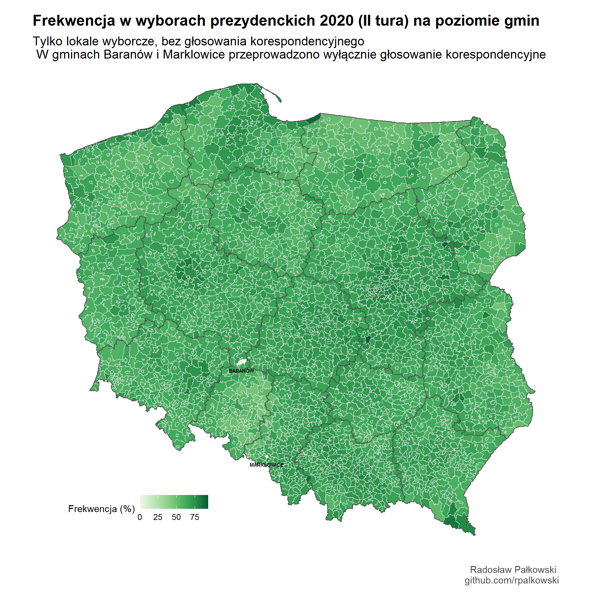
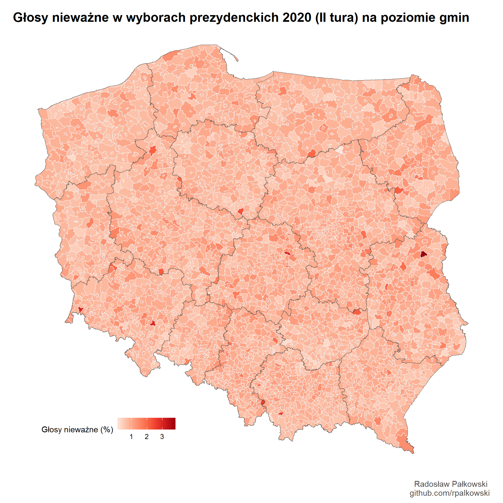
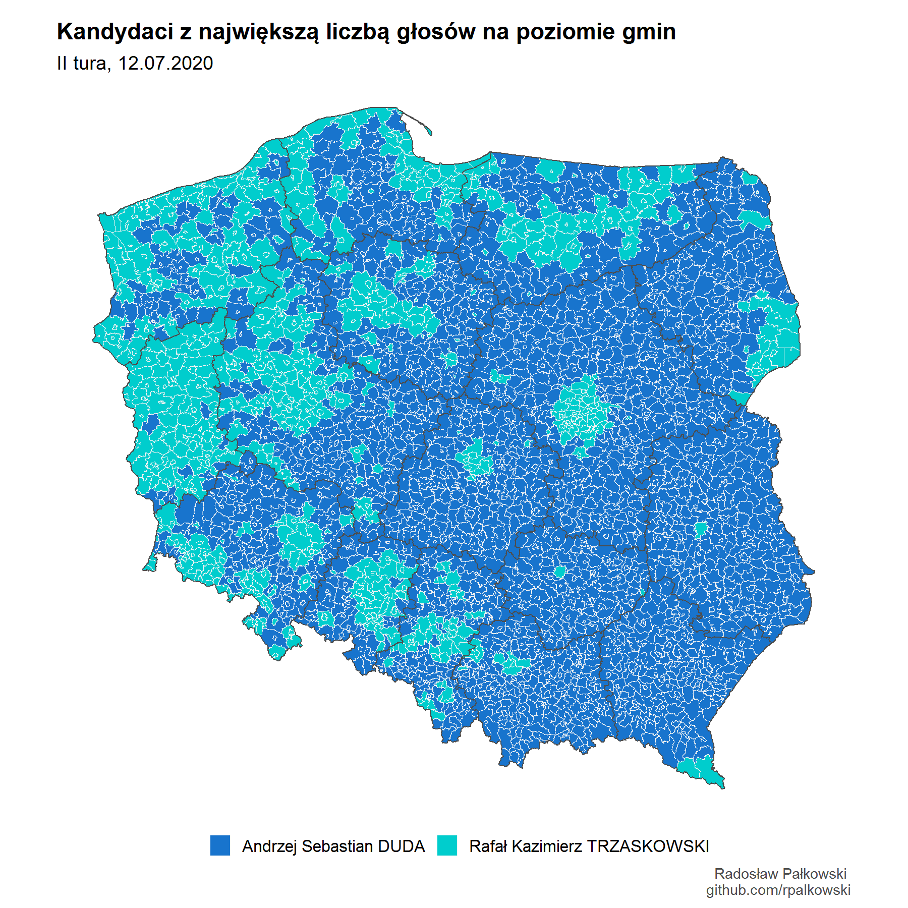
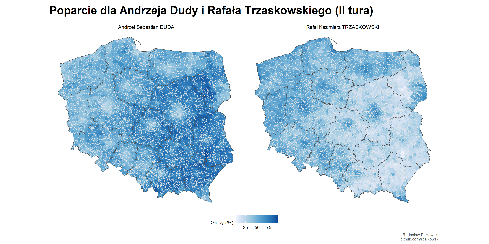
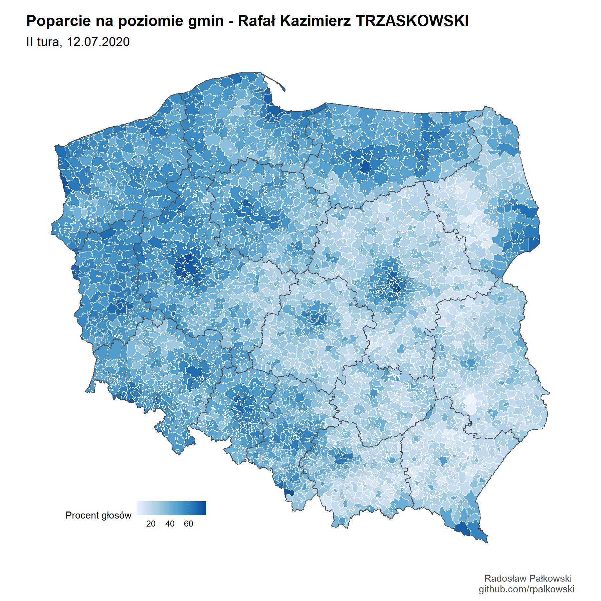
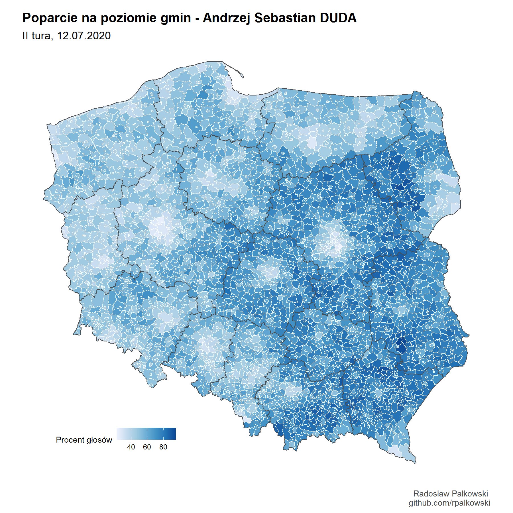

[Powrót](./)

[Mapy w większej rozdzielczości](https://github.com/rpalkowski/wybory-2020/tree/master/II_tura)

------------------------------------------------------------------------

------------------------------------------------------------------------

[Powrót](./)
